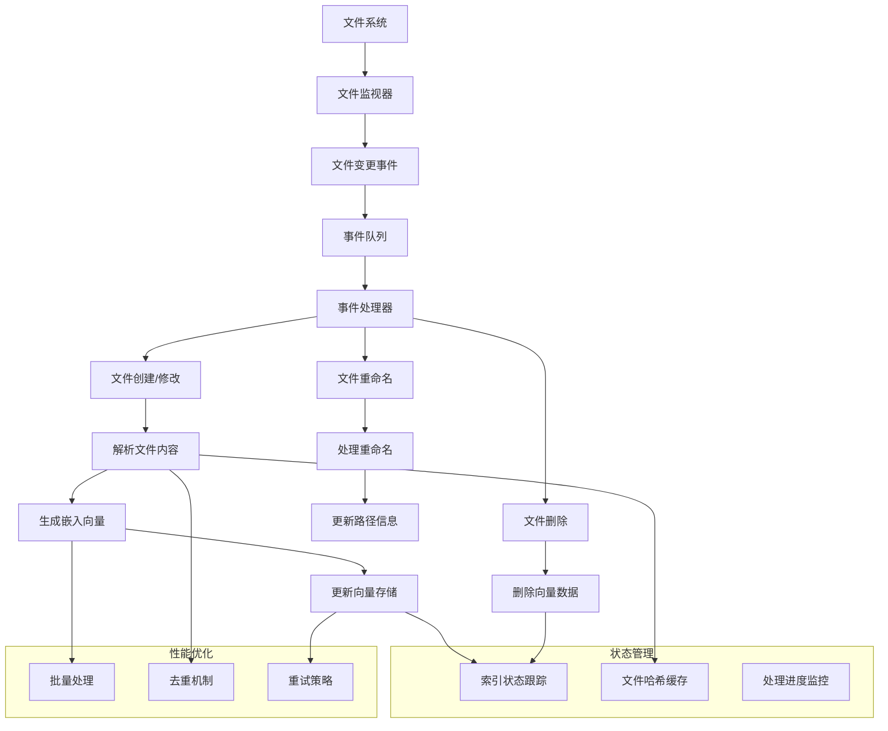

## 增量索引和实时更新方案

基于KiloCode的设计思想，当前架构主要依赖全量索引，缺乏实时更新能力。让我设计一个完整的增量索引和实时更新方案。

### 架构设计：实时索引系统



### 核心实现方案

#### 1. 文件监视器实现

```typescript
interface FileWatcher {
  watch(workspacePath: string): Promise<void>;
  onFileChange(callback: (filePath: string, eventType: FileEventType) => void): void;
  onFileDelete(callback: (filePath: string) => void): void;
  onFileRename(callback: (oldPath: string, newPath: string) => void): void;
  stop(): Promise<void>;
}

type FileEventType = 'create' | 'modify' | 'delete' | 'rename';

class ChokidarFileWatcher implements FileWatcher {
  private watcher: any;
  private changeCallbacks: Array<(filePath: string, eventType: FileEventType) => void> = [];
  private deleteCallbacks: Array<(filePath: string) => void> = [];
  private renameCallbacks: Array<(oldPath: string, newPath: string) => void> = [];

  async watch(workspacePath: string): Promise<void> {
    const chokidar = await import('chokidar');
    
    this.watcher = chokidar.watch(workspacePath, {
      ignored: [
        '**/node_modules/**',
        '**/.git/**',
        '**/dist/**',
        '**/build/**',
        '**/*.log',
        '**/*.tmp'
      ],
      persistent: true,
      ignoreInitial: true,
      awaitWriteFinish: {
        stabilityThreshold: 1000,
        pollInterval: 100
      }
    });

    this.setupEventHandlers();
  }

  private setupEventHandlers(): void {
    this.watcher
      .on('add', (filePath: string) => this.handleChange(filePath, 'create'))
      .on('change', (filePath: string) => this.handleChange(filePath, 'modify'))
      .on('unlink', (filePath: string) => this.handleDelete(filePath))
      .on('unlinkDir', (filePath: string) => this.handleDelete(filePath))
      .on('rename', (oldPath: string, newPath: string) => this.handleRename(oldPath, newPath));
  }

  private handleChange(filePath: string, eventType: FileEventType): void {
    this.changeCallbacks.forEach(callback => callback(filePath, eventType));
  }

  private handleDelete(filePath: string): void {
    this.deleteCallbacks.forEach(callback => callback(filePath));
  }

  private handleRename(oldPath: string, newPath: string): void {
    this.renameCallbacks.forEach(callback => callback(oldPath, newPath));
  }
}
```

#### 2. 增量索引处理器

```typescript
class IncrementalIndexer {
  private fileWatcher: FileWatcher;
  private indexService: IndexService;
  private vectorStore: IVectorStore;
  private stateManager: IndexStateManager;
  private processingQueue: AsyncQueue<FileEvent>;
  private fileHashCache: Map<string, string> = new Map();

  constructor() {
    this.processingQueue = new AsyncQueue({
      concurrency: 5,
      autoStart: true
    });
  }

  async start(workspacePath: string): Promise<void> {
    await this.fileWatcher.watch(workspacePath);
    
    this.fileWatcher.onFileChange((filePath, eventType) => {
      this.processingQueue.add(() => this.handleFileChange(filePath, eventType));
    });

    this.fileWatcher.onFileDelete((filePath) => {
      this.processingQueue.add(() => this.handleFileDelete(filePath));
    });

    this.fileWatcher.onFileRename((oldPath, newPath) => {
      this.processingQueue.add(() => this.handleFileRename(oldPath, newPath));
    });
  }

  private async handleFileChange(filePath: string, eventType: FileEventType): Promise<void> {
    try {
      // 检查文件是否支持索引
      if (!this.isFileSupported(filePath)) {
        return;
      }

      // 读取文件内容并计算哈希
      const content = await fs.readFile(filePath, 'utf-8');
      const newHash = this.calculateContentHash(content);
      const oldHash = this.fileHashCache.get(filePath);

      // 哈希比对，避免重复处理
      if (oldHash === newHash) {
        return; // 内容未变化
      }

      // 更新哈希缓存
      this.fileHashCache.set(filePath, newHash);

      // 处理文件内容
      const blocks = await this.indexService.parseFile(filePath, { content });
      
      // 生成嵌入向量
      const embeddings = await this.embeddingService.createEmbeddings(
        blocks.map(block => block.content)
      );

      // 更新向量存储
      await this.vectorStore.upsertPoints(
        blocks.map((block, index) => ({
          id: block.segmentHash,
          vector: embeddings[index],
          payload: {
            ...block,
            fileHash: newHash
          }
        }))
      );

      this.stateManager.recordProcessedFile(filePath, eventType);

    } catch (error) {
      console.error(`Failed to process file change: ${filePath}`, error);
      this.stateManager.recordError(filePath, error);
    }
  }

  private async handleFileDelete(filePath: string): Promise<void> {
    try {
      // 从向量存储中删除相关数据
      await this.vectorStore.deletePointsByFilePath(filePath);
      
      // 清理哈希缓存
      this.fileHashCache.delete(filePath);
      
      this.stateManager.recordDeletedFile(filePath);

    } catch (error) {
      console.error(`Failed to process file deletion: ${filePath}`, error);
      this.stateManager.recordError(filePath, error);
    }
  }

  private async handleFileRename(oldPath: string, newPath: string): Promise<void> {
    try {
      // 处理文件重命名：先删除旧路径数据，再处理新路径
      await this.handleFileDelete(oldPath);
      
      // 短暂延迟确保删除操作完成
      await new Promise(resolve => setTimeout(resolve, 100));
      
      await this.handleFileChange(newPath, 'create');

    } catch (error) {
      console.error(`Failed to process file rename: ${oldPath} -> ${newPath}`, error);
      this.stateManager.recordError(oldPath, error);
    }
  }
}
```

#### 3. 状态管理和进度跟踪

```typescript
interface IndexState {
  status: 'idle' | 'indexing' | 'watching' | 'error';
  processedFiles: number;
  totalFiles: number;
  lastProcessedFile?: string;
  errors: Array<{ filePath: string; error: string; timestamp: Date }>;
  startTime?: Date;
  endTime?: Date;
}

class IndexStateManager {
  private state: IndexState = {
    status: 'idle',
    processedFiles: 0,
    totalFiles: 0,
    errors: []
  };

  private listeners: Array<(state: IndexState) => void> = [];

  startIndexing(totalFiles: number): void {
    this.state = {
      status: 'indexing',
      processedFiles: 0,
      totalFiles,
      errors: [],
      startTime: new Date()
    };
    this.notifyListeners();
  }

  startWatching(): void {
    this.state.status = 'watching';
    this.notifyListeners();
  }

  recordProcessedFile(filePath: string, eventType: FileEventType): void {
    this.state.processedFiles++;
    this.state.lastProcessedFile = `${filePath} (${eventType})`;
    this.notifyListeners();
  }

  recordDeletedFile(filePath: string): void {
    this.state.processedFiles++;
    this.state.lastProcessedFile = `${filePath} (deleted)`;
    this.notifyListeners();
  }

  recordError(filePath: string, error: Error): void {
    this.state.errors.push({
      filePath,
      error: error.message,
      timestamp: new Date()
    });
    this.notifyListeners();
  }

  getState(): IndexState {
    return { ...this.state };
  }

  addListener(listener: (state: IndexState) => void): void {
    this.listeners.push(listener);
  }

  private notifyListeners(): void {
    this.listeners.forEach(listener => listener(this.getState()));
  }
}
```

#### 4. 异步队列和批处理优化

```typescript
interface AsyncQueueOptions {
  concurrency: number;
  autoStart: boolean;
  maxRetries?: number;
  retryDelay?: number;
}

class AsyncQueue<T> {
  private queue: Array<() => Promise<T>> = [];
  private activeCount = 0;
  private concurrency: number;
  private autoStart: boolean;
  private maxRetries: number;
  private retryDelay: number;

  constructor(options: AsyncQueueOptions) {
    this.concurrency = options.concurrency;
    this.autoStart = options.autoStart;
    this.maxRetries = options.maxRetries || 3;
    this.retryDelay = options.retryDelay || 1000;
  }

  add(task: () => Promise<T>): void {
    this.queue.push(task);
    if (this.autoStart) {
      this.processNext();
    }
  }

  private async processNext(): Promise<void> {
    if (this.activeCount >= this.concurrency || this.queue.length === 0) {
      return;
    }

    this.activeCount++;
    const task = this.queue.shift()!;

    try {
      await this.executeWithRetry(task);
    } catch (error) {
      console.error('Async task failed after retries:', error);
    } finally {
      this.activeCount--;
      this.processNext();
    }
  }

  private async executeWithRetry(task: () => Promise<T>): Promise<T> {
    let lastError: Error;
    
    for (let attempt = 1; attempt <= this.maxRetries; attempt++) {
      try {
        return await task();
      } catch (error) {
        lastError = error;
        
        if (attempt < this.maxRetries) {
          const delay = this.retryDelay * Math.pow(2, attempt - 1);
          await new Promise(resolve => setTimeout(resolve, delay));
        }
      }
    }
    
    throw lastError!;
  }
}
```

#### 5. 哈希缓存和去重机制

```typescript
class FileHashManager {
  private hashCache: Map<string, string> = new Map();
  private cacheFile: string;

  constructor(cacheDir: string) {
    this.cacheFile = path.join(cacheDir, 'file-hashes.json');
    this.loadCache();
  }

  async getFileHash(filePath: string): Promise<string> {
    const cachedHash = this.hashCache.get(filePath);
    if (cachedHash) {
      return cachedHash;
    }

    try {
      const content = await fs.readFile(filePath, 'utf-8');
      const hash = this.calculateHash(content);
      this.hashCache.set(filePath, hash);
      return hash;
    } catch (error) {
      throw new Error(`Failed to read file for hashing: ${filePath}`);
    }
  }

  updateFileHash(filePath: string, hash: string): void {
    this.hashCache.set(filePath, hash);
    this.saveCache();
  }

  removeFileHash(filePath: string): void {
    this.hashCache.delete(filePath);
    this.saveCache();
  }

  private calculateHash(content: string): string {
    return createHash('sha256').update(content).digest('hex');
  }

  private async loadCache(): Promise<void> {
    try {
      if (await fs.pathExists(this.cacheFile)) {
        const data = await fs.readJson(this.cacheFile);
        this.hashCache = new Map(Object.entries(data));
      }
    } catch (error) {
      console.warn('Failed to load hash cache:', error);
    }
  }

  private async saveCache(): Promise<void> {
    try {
      const data = Object.fromEntries(this.hashCache);
      await fs.writeJson(this.cacheFile, data, { spaces: 2 });
    } catch (error) {
      console.warn('Failed to save hash cache:', error);
    }
  }
}
```

#### 6. 集成到MCP服务

```typescript
class IncrementalIndexingService {
  private incrementalIndexer: IncrementalIndexer;
  private stateManager: IndexStateManager;

  async initialize(): Promise<void> {
    this.incrementalIndexer = new IncrementalIndexer();
    this.stateManager = new IndexStateManager();

    // 设置状态监听
    this.stateManager.addListener(state => {
      this.emitIndexingState(state);
    });

    // 初始全量索引
    await this.performFullIndexing();

    // 启动文件监视
    await this.startFileWatching();
  }

  private async performFullIndexing(): Promise<void> {
    this.stateManager.startIndexing(0); // 初始化为0，后续动态更新
    
    const files = await this.scanWorkspace();
    this.stateManager.state.totalFiles = files.length;

    for (const filePath of files) {
      await this.incrementalIndexer.handleFileChange(filePath, 'create');
    }
  }

  private async startFileWatching(): Promise<void> {
    await this.incrementalIndexer.start(this.workspacePath);
    this.stateManager.startWatching();
  }

  private emitIndexingState(state: IndexState): void {
    // 通过MCP协议向客户端发送状态更新
    this.mcpServer.emitEvent('indexing-progress', {
      status: state.status,
      processed: state.processedFiles,
      total: state.totalFiles,
      lastFile: state.lastProcessedFile,
      errors: state.errors.length
    });
  }
}
```

### 性能优化策略

1. **批量处理**: 将多个文件变更合并为批量操作
2. **去重机制**: 基于内容哈希避免重复处理未变化的文件
3. **速率限制**: 控制嵌入API调用频率，避免超限
4. **内存优化**: 流式处理大文件，避免内存溢出
5. **重试机制**: 实现指数退避重试策略处理临时错误

这个增量索引和实时更新方案提供了高效的代码库同步能力，支持实时文件变更检测和智能处理，大大提升了索引系统的响应性和实用性。