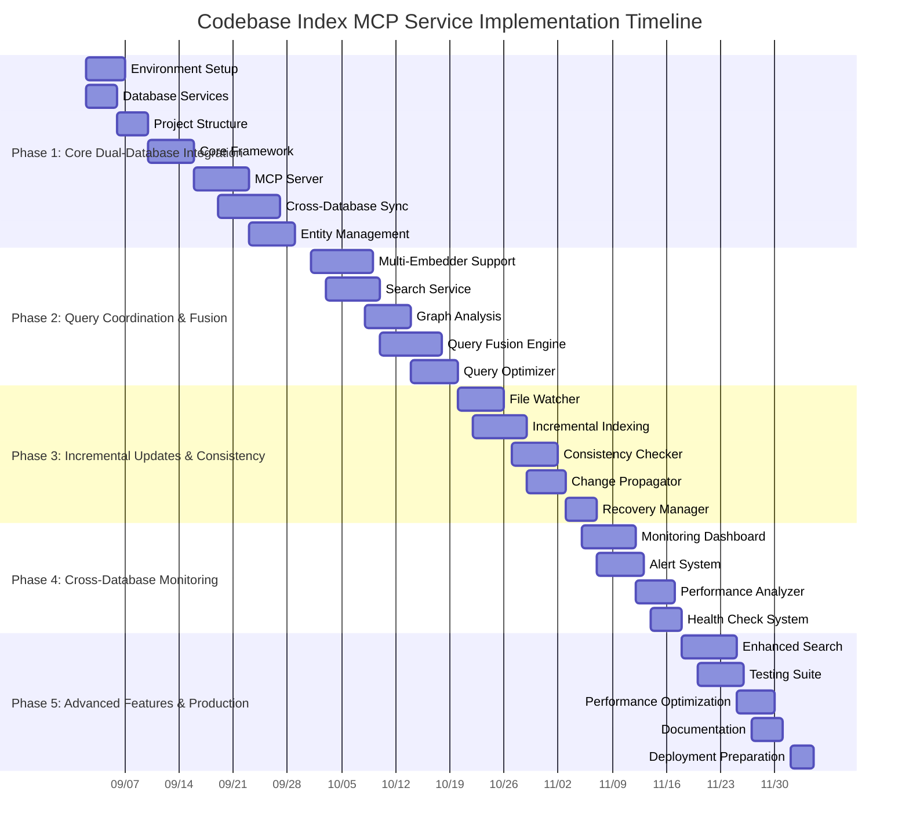

# Codebase Index MCP Service - Implementation Roadmap

## 📅 Timeline Overview

### 12-Week Implementation Schedule (Based on Architecture Analysis)

## 🎯 Weekly Implementation Plan

### Week 1: Foundation Setup (Sep 2-6)
**Focus**: Environment and Infrastructure
- **Monday**: Install development tools, configure Node.js and Docker
- **Tuesday**: Set up Qdrant and Neo4j Docker containers
- **Wednesday**: Verify database connectivity, create initial schemas
- **Thursday**: Initialize TypeScript project, configure package.json
- **Friday**: Create basic directory structure, set up Git repository

**Deliverables**:
- Development environment ready
- Database services running
- Project structure created

### Week 2: Core Framework (Sep 9-13)
**Focus**: Basic Framework Implementation
- **Monday**: Implement dependency injection container
- **Tuesday**: Create configuration management system
- **Wednesday**: Set up logging infrastructure
- **Thursday**: Implement basic error handling
- **Friday**: Code review and framework validation

**Deliverables**:
- Dependency injection working
- Configuration system implemented
- Logging and error handling operational

### Week 3: MCP Server & Database Clients (Sep 16-20)
**Focus**: Protocol and Database Integration
- **Monday**: Implement MCP protocol handler
- **Tuesday**: Create tool registration system
- **Wednesday**: Integrate Qdrant client with connection pooling
- **Thursday**: Integrate Neo4j client with session management
- **Friday**: Basic MCP server and database connectivity testing

**Deliverables**:
- MCP server responding to requests
- Both database clients operational
- Tool registration system working

### Week 4: Cross-Database Sync (Sep 23-27)
**Focus**: Data Consistency and Synchronization
- **Monday**: Design cross-database entity ID system
- **Tuesday**: Implement entity mapping service
- **Wednesday**: Develop transaction coordination mechanism
- **Thursday**: Create compensating transaction system
- **Friday**: Cross-database sync testing and validation

**Deliverables**:
- Unified entity management system
- Cross-database synchronization working
- Data consistency guarantees established

### Week 5: Query Coordination (Sep 30-Oct 4)
**Focus**: Query Fusion and Coordination
- **Monday**: Implement query coordination service
- **Tuesday**: Develop result fusion engine
- **Wednesday**: Create query optimization system
- **Thursday**: Implement parallel query execution
- **Friday**: Query performance testing and optimization

**Deliverables**:
- Query coordination service operational
- Result fusion working correctly
- Query optimization active

### Week 6: Multi-Embedder Integration (Oct 7-11)
**Focus**: Embedding Provider Support
- **Monday**: Implement embedder factory pattern
- **Tuesday**: Integrate OpenAI embedder
- **Wednesday**: Integrate Ollama embedder
- **Thursday**: Implement automatic dimension adaptation
- **Friday**: Multi-embedder testing and validation

**Deliverables**:
- Multiple embedding providers supported
- Automatic dimension adaptation working
- Embedder switching operational
- Metadata extraction implemented

### Week 5: Database Integration (Sep 30-Oct 4)
**Focus**: Database Clients
- **Monday**: Create Qdrant client wrapper
- **Tuesday**: Implement Neo4j connection manager
- **Wednesday**: Develop vector operations
- **Thursday**: Create graph query builder
- **Friday**: Database integration testing

**Deliverables**:
- Database connections established
- Basic vector and graph operations working

### Week 6: Multi-Embedder Support (Oct 7-11)
**Focus**: Embedding Providers
- **Monday**: Implement embedder factory pattern
- **Tuesday**: Create OpenAI embedder
- **Wednesday**: Develop Ollama embedder
- **Thursday**: Add Gemini and Mistral support
- **Friday**: Automatic dimension adaptation

**Deliverables**:
- Multiple embedder providers supported
- Dimension adaptation working

### Week 7: Search and Analysis (Oct 14-18)
**Focus**: Search Functionality
- **Monday**: Develop semantic search algorithm
- **Tuesday**: Implement hybrid search (vector + text)
- **Wednesday**: Create result ranking system
- **Thursday**: Add filtering and sorting options
- **Friday**: Graph analysis implementation

**Deliverables**:
- Semantic search functional
- Graph analysis working

### Week 8: Real-time Processing (Oct 21-25)
**Focus**: File Monitoring
- **Monday**: Integrate Chokidar file monitoring
- **Tuesday**: Implement event processing queue
- **Wednesday**: Create change detection mechanism
- **Thursday**: Develop batch processing
- **Friday**: Incremental indexing testing

**Deliverables**:
- File watcher monitoring changes
- Incremental indexing working

### Week 9: Monitoring and Testing (Oct 28-Nov 1)
**Focus**: System Reliability
- **Monday**: Integrate Prometheus metrics
- **Tuesday**: Create health check endpoints
- **Wednesday**: Develop comprehensive test suite
- **Thursday**: Performance benchmarking
- **Friday**: Error handling validation

**Deliverables**:
- Monitoring system active
- Test coverage >80%

### Week 10: Production Preparation (Nov 4-8)
**Focus**: Deployment Readiness
- **Monday**: Performance optimization
- **Tuesday**: Create user documentation
- **Wednesday**: Develop deployment scripts
- **Thursday**: Prepare monitoring dashboards
- **Friday**: Final validation and review

**Deliverables**:
- Performance optimized
- Documentation complete
- Deployment ready

## 👥 Resource Allocation

### Development Team (1 Developer)
- **Full-time commitment**: 40 hours/week
- **Skills required**: TypeScript, Node.js, Docker, Database integration
- **Additional skills**: MCP protocol, AI/ML concepts, monitoring

### Infrastructure Requirements
- **Development Machine**: 16GB RAM, 4-core CPU, 50GB storage
- **Docker Containers**: Qdrant, Neo4j, optional monitoring stack
- **Network**: Stable internet for API calls (OpenAI, etc.)
- **Storage**: Local or network storage for code repositories

### External Services
- **OpenAI API**: For embedding generation (usage-based cost)
- **Optional**: Ollama local inference, other embedding providers
- **Monitoring**: Prometheus/Grafana for production deployment

## 📊 Progress Tracking Metrics

### Weekly Progress Indicators
- **Code Commits**: Number of meaningful commits
- **Features Completed**: Percentage of planned features
- **Test Coverage**: Code coverage percentage
- **Bug Count**: New vs. resolved bugs
- **Performance**: Response time measurements

### Quality Metrics
- **Code Quality**: ESLint/Prettier compliance
- **Test Coverage**: Minimum 80% for new code
- **Documentation**: Completeness of comments and docs
- **Performance**: Meets target response times

## 🚀 Risk Management Plan

### Technical Risks and Mitigation

#### Risk: Database Performance Issues
- **Impact**: Slow search response, system instability
- **Probability**: Medium
- **Mitigation**: 
  - Implement connection pooling
  - Add query optimization
  - Monitor database performance metrics
  - Plan for database scaling

#### Risk: API Rate Limiting
- **Impact**: Service interruptions, delayed processing
- **Probability**: High
- **Mitigation**:
  - Implement request throttling
  - Add retry with exponential backoff
  - Support multiple API providers
  - Cache embedding results

#### Risk: Memory Management
- **Impact**: System crashes, poor performance
- **Probability**: Medium
- **Mitigation**:
  - Implement streaming processing
  - Add memory usage monitoring
  - Set memory limits
  - Optimize data structures

#### Risk: File System Issues
- **Impact**: Data corruption, processing failures
- **Probability**: Low
- **Mitigation**:
  - Handle permission errors gracefully
  - Implement file locking
  - Add corrupted file handling
  - Regular backups

## 🔧 Contingency Planning

### Schedule Buffer
- **Total buffer time**: 2 weeks (20% of timeline)
- **Distribution**: 1 week mid-project, 1 week at end
- **Usage**: For unexpected issues, additional testing

### Priority Adjustment
- **Core functionality**: Must complete (Weeks 1-4)
- **Advanced features**: Can be deferred if needed (Weeks 5-7)
- **Nice-to-have features**: Lowest priority (Weeks 8-10)

### Fallback Options
- **Database issues**: Implement local caching, reduce functionality
- **API limitations**: Switch to alternative providers, reduce features
- **Performance problems**: Optimize later, focus on functionality first

## 📈 Success Criteria

### Development Success
- ✅ All milestones completed on time
- ✅ Code quality meets standards
- ✅ Test coverage >90%
- ✅ Performance targets achieved

### Operational Success
- ✅ System availability >99.9%
- ✅ Error rate <0.1%
- ✅ Response time <200ms
- ✅ User satisfaction high

### Business Success
- ✅ Developer productivity improved
- ✅ Code search time reduced
- ✅ Multiple language support
- ✅ Easy integration with Kode CLI

## 🎯 Key Decision Points

### Week 3: MCP Protocol Implementation
- Decision: Continue with current approach or adjust based on MCP complexity
- Criteria: Protocol implementation progress, tool registration working

### Week 5: Database Integration
- Decision: Proceed with current database choices or consider alternatives
- Criteria: Database performance, connection stability

### Week 7: Multi-Embedder Support
- Decision: Which embedding providers to prioritize
- Criteria: API reliability, cost considerations, performance

### Week 9: Production Readiness
- Decision: Ready for production deployment or need additional testing
- Criteria: Test results, performance metrics, error rates

## 📝 Weekly Review Process

### Daily Standups (15 minutes)
- Progress since last standup
- Plans for current day
- Blockers and issues

### Weekly Reviews (1 hour)
- Review progress against plan
- Adjust priorities if needed
- Address technical challenges
- Plan for next week

### Bi-weekly Demos (30 minutes)
- Show working functionality
- Gather feedback
- Validate approach

This implementation roadmap provides a detailed schedule, resource allocation, risk management, and success criteria to guide the successful delivery of the Codebase Index MCP Service.