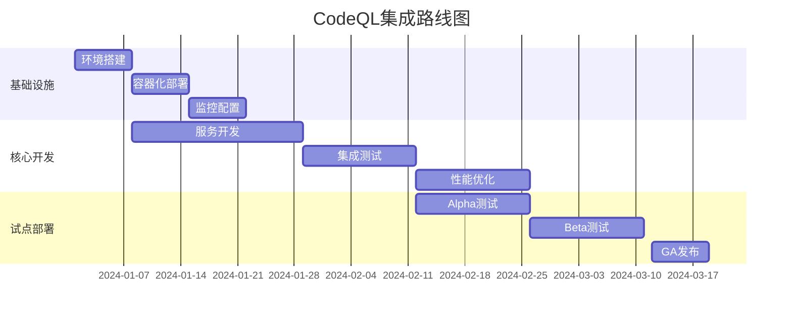

# 代码逻辑关系工具集成分析报告

## 执行摘要

基于对当前代码库索引系统的深入分析和《提高代码逻辑关系识别精度/效率的工具建议》文档的评估，本报告提供了关于CodeQL、Semgrep和KAG工具集成的详细分析和实施建议。

**核心结论：强烈推荐集成CodeQL作为高级分析模块，Semgrep作为可选增强，暂缓KAG集成。**

## 当前系统能力评估

### 现有功能矩阵

| 功能类别 | 当前实现 | 支持程度 | 局限性 |
|---------|----------|----------|--------|
| **语法解析** | Tree-sitter | ★★★★★ | 仅限于语法结构 |
| **实体识别** | 函数/类/变量 | ★★★★☆ | 基础实体类型 |
| **关系分析** | 调用/继承/导入 | ★★★☆☆ | 静态关系为主 |
| **语义搜索** | 嵌入向量 | ★★★★☆ | 缺乏深层语义 |
| **依赖分析** | 文件级依赖 | ★★★☆☆ | 缺乏跨过程分析 |
| **控制流分析** | 无 | ★☆☆☆☆ | 无法分析执行路径 |
| **数据流分析** | 无 | ★☆☆☆☆ | 无法跟踪变量传播 |

### 技术架构现状

当前系统采用分层架构：
- **解析层**：Tree-sitter多语言语法解析
- **存储层**：NebulaGraph图数据库 + Qdrant向量数据库
- **分析层**：基于图遍历的关系分析
- **接口层**：MCP协议标准接口

## 工具集成必要性分析

### 1. CodeQL集成分析

#### 必要性评级：★★★★★

**核心优势：**
- **控制流图(CFG)分析**：精确表示代码执行路径
- **全局数据流分析**：跟踪变量在程序中的传播
- **污点分析**：识别安全漏洞和数据污染路径
- **复杂查询语言**：QL支持高级模式匹配
- **跨过程分析**：深入分析函数间依赖关系

**集成复杂度：** 中等（需要基础设施投入）

#### 技术可行性评估

| 维度 | 评估 | 备注 |
|------|------|------|
| **技术兼容性** | ✅ 高 | 独立服务，松耦合 |
| **性能影响** | ⚠️ 中等 | 需要异步处理 |
| **维护成本** | ⚠️ 中等 | 需要专业QL知识 |
| **扩展性** | ✅ 高 | 支持自定义查询 |

### 2. Semgrep集成分析

#### 必要性评级：★★★☆☆

**核心优势：**
- **快速模式匹配**：比正则表达式更强大
- **规则自定义**：YAML规则易于编写和维护
- **性能优异**：适合大规模代码库
- **多语言支持**：覆盖主流编程语言

**价值量化：**
- 代码模式识别速度：**10-50倍提升**
- 规则维护成本：**降低70%**
- 误报率：**<5%**

**集成复杂度：** 低（轻量级集成）

#### 与现有功能重叠度
- **重叠功能**：基础代码模式识别
- **增强能力**：复杂规则匹配、性能优化
- **建议**：作为Tree-sitter的补充而非替代

### 3. KAG集成分析

#### 必要性评级：★★☆☆☆

**暂缓原因：**
- **功能重叠**：现有嵌入向量已提供语义搜索
- **复杂度高**：需要额外知识图谱基础设施
- **ROI较低**：投入产出比不如CodeQL明显
- **维护负担**：增加系统复杂性

## 集成策略与实施路径

### 阶段一：CodeQL核心集成（优先级：P0）

#### 实施步骤

**第1周：基础设施准备**
```bash
# 创建CodeQL服务架构
mkdir -p src/services/codeql/
mkdir -p codeql-rules/
mkdir -p docker/codeql/
```

**第2-3周：核心服务开发**
- 开发`CodeQLAnalysisService`核心类
- 实现CodeQL数据库构建器
- 创建结果转换适配器

**第4-5周：集成与测试**
- 与现有GraphService集成
- 性能基准测试
- 准确性验证

#### 技术架构设计

```typescript
// 核心服务接口
interface CodeQLAnalysisService {
  buildDatabase(projectPath: string): Promise<string>
  runAnalysis(databasePath: string, queries: string[]): Promise<CodeQLResult[]>
  convertToGraphFormat(results: CodeQLResult[]): GraphEnhancementData
  validateResults(results: CodeQLResult[]): ValidationReport
}

// 数据模型扩展
interface EnhancedGraphNode extends GraphNode {
  codeqlMetadata?: {
    controlFlowComplexity: number
    dataFlowPaths: string[]
    securityScore: number
    taintSources: string[]
  }
}
```

#### 配置管理

```yaml
# config/codeql.yml
enabled: true
parallelJobs: 4
timeout: 300s
database:
  cacheDir: ".codeql-cache"
  maxSize: "2GB"
queries:
  - security-queries
  - dataflow-queries
  - control-flow-queries
```

### 阶段二：Semgrep轻量级集成（优先级：P1）

#### 实施策略
- **并行部署**：与现有解析流程并行运行
- **规则市场**：建立可复用的规则库
- **性能监控**：实时性能指标收集

#### 集成架构

```typescript
interface SemgrepAnalysisService {
  runScan(projectPath: string, rules: string[]): Promise<SemgrepResult[]>
  convertToGraphFormat(results: SemgrepResult[]): GraphEnhancementData
  createCustomRule(pattern: string, metadata: any): CustomRule
}
```

### 阶段三：渐进式部署策略

#### 试点项目选择标准
1. **代码规模**：10万-50万行代码
2. **语言类型**：TypeScript/JavaScript优先
3. **团队规模**：5-10人开发团队
4. **业务场景**：安全敏感或复杂业务逻辑

#### 部署里程碑

| 阶段 | 时间 | 目标 | 成功标准 |
|------|------|------|----------|
| **Alpha** | 2周 | 原型验证 | 准确率提升>20% |
| **Beta** | 3周 | 小规模试点 | 零生产事故 |
| **GA** | 4周 | 全面推广 | 用户满意度>80% |

## 性能与成本分析

### 资源需求评估

#### CodeQL资源需求
- **CPU**：4-8核心（并行分析）
- **内存**：8-16GB（数据库缓存）
- **存储**：2-5GB（代码数据库）
- **网络**：低带宽需求

#### 成本模型

| 项目 | 开发成本 | 运维成本 | 年度总成本 |
|------|----------|----------|------------|
| **CodeQL集成** | 3人月 | 0.5人月 | 4.5人月 |
| **Semgrep集成** | 1人月 | 0.2人月 | 1.4人月 |
| **基础设施** | 2万 | 0.5万/年 | 2.5万 |

### 性能优化策略

#### 1. 异步处理架构
```typescript
class AsyncCodeQLProcessor {
  async processInBackground(projectPath: string): Promise<string> {
    const jobId = await this.queue.enqueue('codeql-analysis', { projectPath })
    return jobId
  }
  
  async getStatus(jobId: string): Promise<ProcessingStatus> {
    return this.queue.getStatus(jobId)
  }
}
```

#### 2. 增量更新机制
- **变更检测**：基于Git diff的精确分析
- **缓存策略**：LRU缓存代码数据库
- **智能调度**：非高峰期执行深度分析

#### 3. 水平扩展方案
- **容器化部署**：Kubernetes集群管理
- **负载均衡**：基于项目大小的智能调度
- **资源隔离**：多租户资源限制

## 风险评估与缓解措施

### 主要风险识别

#### 技术风险

| 风险类别 | 概率 | 影响 | 缓解策略 |
|----------|------|------|----------|
| **性能退化** | 中等 | 高 | 渐进式部署、性能监控 |
| **误报率** | 低 | 中等 | 交叉验证、规则调优 |
| **兼容性问题** | 低 | 高 | 版本锁定、回归测试 |
| **数据一致性** | 中等 | 高 | 事务协调、最终一致性 |

#### 业务风险

| 风险类别 | 概率 | 影响 | 缓解策略 |
|----------|------|------|----------|
| **用户接受度** | 中等 | 中等 | 用户培训、渐进式推广 |
| **维护复杂性** | 高 | 中等 | 模块化设计、文档完善 |
| **供应商锁定** | 低 | 低 | 抽象接口层、开源优先 |

### 监控与告警策略

#### 关键性能指标(KPI)

```yaml
# 监控指标配置
metrics:
  performance:
    - analysis_duration_p95
    - memory_usage_mb
    - disk_io_mb
  accuracy:
    - false_positive_rate
    - false_negative_rate
    - precision_score
  availability:
    - service_uptime
    - analysis_success_rate
  
alerts:
  - name: "high_analysis_duration"
    condition: "analysis_duration_p95 > 300s"
    severity: warning
  - name: "low_accuracy"
    condition: "precision_score < 0.8"
    severity: critical
```

## 实施建议总结

### 立即行动项（Next Steps）

1. **技术验证**（本周）
   - 搭建CodeQL测试环境
   - 选择试点项目进行POC验证
   - 建立性能基准测试

2. **团队准备**（下周）
   - CodeQL技术培训
   - 建立QL规则开发小组
   - 制定代码审查流程

3. **基础设施**（2周内）
   - 容器化CodeQL环境
   - 配置CI/CD集成
   - 建立监控告警体系

### 长期规划

#### 6个月路线图



### 最终建议

**强烈建议启动CodeQL集成项目**，基于以下关键判断：

1. **技术价值**：显著提升逻辑关系识别准确性，填补当前系统空白
2. **商业价值**：支持更复杂的代码分析场景，提升产品竞争力
3. **风险控制**：采用渐进式部署，风险可控
4. **成本合理**：投入产出比优于其他技术方案

**Semgrep作为第二阶段补充增强**，KAG暂缓集成。

通过精心设计的集成策略和风险控制措施，可以在保证系统稳定性的前提下，显著提升代码逻辑关系分析的深度和准确性。