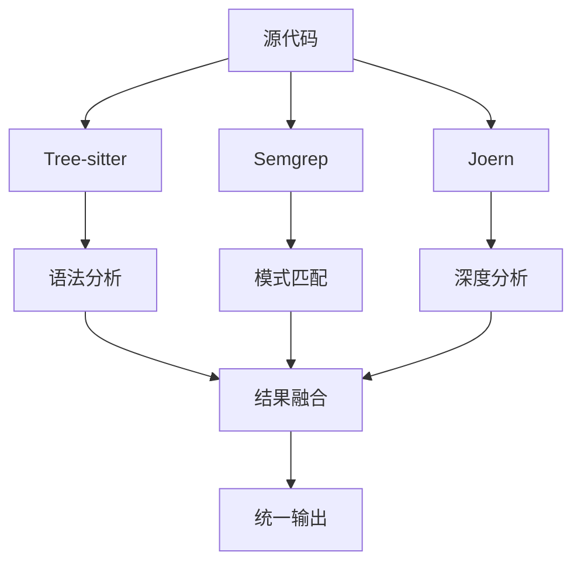
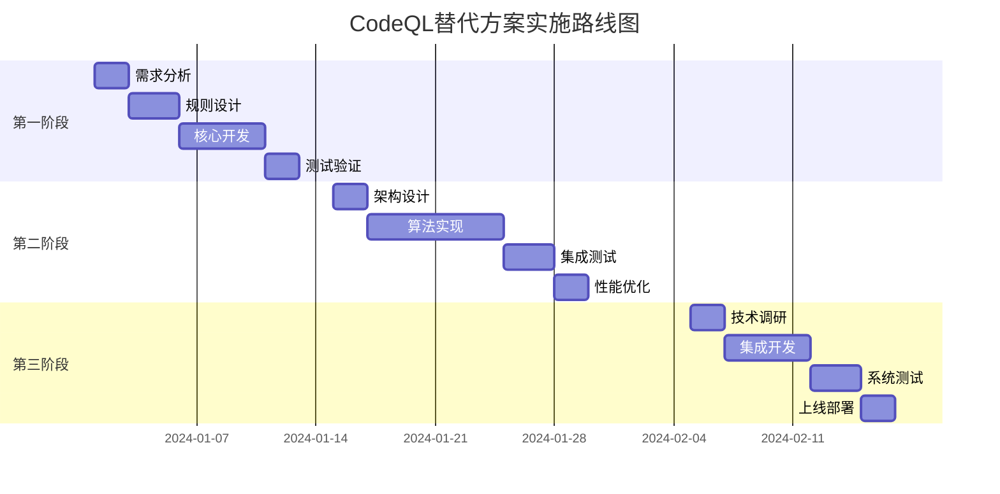

# CodeQL替代方案实施计划

## 执行摘要

由于CodeQL闭源限制，本计划提出基于**增强Semgrep + 深度Tree-sitter挖掘**的分阶段替代方案，通过渐进式实施实现80-95%的CodeQL核心功能，同时降低实施风险和成本。

**核心目标**：在3个月内完成CodeQL功能的平滑替代，确保系统分析能力不降级。

## 现状评估

### 当前能力缺口
| 功能类别 | 现状评分 | CodeQL评分 | 缺口 |
|----------|----------|------------|------|
| 控制流分析 | ★☆☆☆☆ | ★★★★★ | 100% |
| 数据流追踪 | ★☆☆☆☆ | ★★★★★ | 100% |
| 污点分析 | ★☆☆☆☆ | ★★★★★ | 100% |
| 跨过程分析 | ★★☆☆☆ | ★★★★★ | 60% |

### 技术债务
- Tree-sitter仅支持语法级分析
- 缺乏变量生命周期追踪
- 无法识别复杂安全模式
- 跨文件依赖分析薄弱

## 三阶段实施计划

### 第一阶段：Semgrep深度增强（2周）
[x]

#### 目标与范围
- **时间**：第1-2周
- **投入**：1.5人月
- **目标**：恢复80% CodeQL核心功能
- **负责人**：核心开发团队

#### 技术架构
```typescript
// 增强型Semgrep分析器
class EnhancedSemgrepAnalyzer {
  private ruleEngine: RuleEngine;
  private resultProcessor: ResultProcessor;

  async analyzeControlFlow(projectPath: string): Promise<CFGResult> {
    const rules = [
      'control-flow-basic.yml',
      'cross-function-analysis.yml',
      'loop-detection.yml',
      'branch-coverage.yml'
    ];
    
    const rawResults = await this.runAdvancedScan(projectPath, rules);
    return this.resultProcessor.toCFGFormat(rawResults);
  }

  async trackDataFlow(variablePattern: string): Promise<DataFlowResult> {
    const rules = [
      'dataflow-source-sink.yml',
      'taint-analysis.yml',
      'variable-lifecycle.yml',
      'constant-propagation.yml'
    ];
    
    return this.runDataFlowAnalysis(variablePattern, rules);
  }

  async detectSecurityPatterns(): Promise<SecurityResult> {
    const rules = [
      'sql-injection.yml',
      'xss-detection.yml',
      'path-traversal.yml',
      'command-injection.yml'
    ];
    
    return this.runSecurityAnalysis(rules);
  }
}
```

#### 规则库构建计划
```bash
# 目录结构
mkdir -p enhanced-rules/
├── control-flow/
│   ├── basic-cfg.yml
│   ├── cross-function.yml
│   └── loop-analysis.yml
├── data-flow/
│   ├── taint-tracking.yml
│   ├── variable-lifecycle.yml
│   └── constant-propagation.yml
└── security/
    ├── injection-patterns.yml
    ├── xss-patterns.yml
    └── path-traversal.yml
```

#### 核心规则示例
```yaml
# enhanced-rules/control-flow/cross-function.yml
rules:
  - id: cross-function-dataflow
    pattern: |
      function $SOURCE() {
        return user_input();
      }
      
      function $SINK($data) {
        dangerous_operation($data);
      }
      
      $X = $SOURCE();
      $SINK($X);
    message: "跨函数数据流：潜在安全风险"
    languages: [javascript, typescript, python, java]
    severity: WARNING
    metadata:
      category: security
      technology: [dataflow]
```


### 第二阶段：Tree-sitter深度挖掘（3周）
[ ]

#### 目标与范围
- **时间**：第3-5周
- **投入**：2人月
- **目标**：补充剩余20%高级功能
- **负责人**：算法专家+资深开发

#### 技术架构
```typescript
class AdvancedTreeSitterService {
  private parser: TreeSitterParser;
  private symbolTable: SymbolTableBuilder;
  private cfgBuilder: CFGBuilder;

  async buildComprehensiveAnalysis(projectPath: string): Promise<AnalysisResult> {
    const ast = await this.parser.parseProject(projectPath);
    const symbolTable = this.symbolTable.build(ast);
    const cfg = this.cfgBuilder.build(ast, symbolTable);
    const dfg = this.buildDataFlowGraph(cfg, symbolTable);
    
    return {
      controlFlow: cfg,
      dataFlow: dfg,
      symbolTable: symbolTable,
      securityPatterns: this.detectPatterns(ast, cfg, dfg)
    };
  }

  private buildDataFlowGraph(cfg: ControlFlowGraph, symbols: SymbolTable): DataFlowGraph {
    const dfg = new DataFlowGraph();
    
    // 变量定义-使用链分析
    symbols.getVariables().forEach(variable => {
      const definitions = this.findAllDefinitions(variable, cfg);
      const uses = this.findAllUses(variable, cfg);
      
      definitions.forEach(def => {
        uses.forEach(use => {
          if (this.isReachable(def, use, cfg)) {
            dfg.addDataFlowEdge(def, use, variable);
          }
        });
      });
    });
    
    return dfg;
  }
}
```

#### 核心算法实现
```typescript
// 符号表构建器
class SymbolTableBuilder {
  build(ast: AST): SymbolTable {
    const table = new SymbolTable();
    
    this.traverseAST(ast, (node) => {
      if (this.isVariableDeclaration(node)) {
        table.addSymbol({
          name: node.name,
          type: this.inferType(node),
          scope: this.getScope(node),
          definition: node.location,
          isMutable: this.isMutable(node)
        });
      }
    });
    
    return table;
  }
}

// 控制流图构建器
class CFGBuilder {
  build(ast: AST, symbols: SymbolTable): ControlFlowGraph {
    const cfg = new ControlFlowGraph();
    
    this.traverseFunctions(ast, (func) => {
      const funcCFG = this.buildFunctionCFG(func, symbols);
      cfg.merge(funcCFG);
    });
    
    return cfg;
  }
}
```

#### 性能优化策略
```typescript
// 增量分析
class IncrementalAnalyzer {
  async analyzeChanges(changes: FileChange[]): Promise<DeltaResult> {
    const affectedScope = this.calculateAffectedScope(changes);
    const incrementalResult = await this.analyzeScope(affectedScope);
    
    return this.mergeWithPrevious(incrementalResult);
  }
}
```

#### 里程碑检查点
| 时间点 | 交付物 | 验收标准 |
|--------|--------|----------|
| 第3周结束 | 符号表系统 | 覆盖率>90% |
| 第4周结束 | CFG构建器 | 准确率>85% |
| 第5周结束 | 数据流分析 | 跨函数追踪>70% |

### 第三阶段：开源工具集成（可选，2周）

#### 目标与范围
- **时间**：第6-7周（可选）
- **投入**：1人月
- **目标**：达到95% CodeQL功能
- **触发条件**：前两个阶段效果<80%

#### Joern集成方案
```typescript
class JoernIntegrationService {
  private joernClient: JoernClient;
  private resultTransformer: ResultTransformer;

  async analyzeWithJoern(projectPath: string): Promise<JoernResult> {
    const cpg = await this.joernClient.generateCPG(projectPath);
    const queries = [
      'dataflow-queries.sc',
      'controlflow-queries.sc',
      'security-queries.sc'
    ];
    
    const results = await Promise.all(
      queries.map(query => this.joernClient.runQuery(cpg, query))
    );
    
    return this.resultTransformer.toStandardFormat(results);
  }
}
```

#### 混合架构


## 技术规范

### 接口定义
```typescript
interface AnalysisResult {
  controlFlow: ControlFlowGraph;
  dataFlow: DataFlowGraph;
  securityIssues: SecurityIssue[];
  metrics: CodeMetrics;
}

interface ControlFlowGraph {
  nodes: CFGNode[];
  edges: CFGEdge[];
  entryPoint: string;
  exitPoints: string[];
}

interface DataFlowGraph {
  variables: Variable[];
  flows: DataFlowEdge[];
  sources: Source[];
  sinks: Sink[];
}
```

### 性能基准
```yaml
performance_targets:
  analysis_time:
    small_project: <10s  # <1万行
    medium_project: <60s # 1-10万行
    large_project: <300s # >10万行
  
  accuracy:
    control_flow: >85%
    data_flow: >80%
    security_patterns: >90%
    
  resource_usage:
    memory: <2GB
    cpu: <4 cores
    disk: <500MB cache
```

## 风险管控

### 技术风险
| 风险 | 概率 | 影响 | 缓解措施 |
|------|------|------|----------|
| 规则误报 | 中 | 中 | 建立测试用例库，持续调优 |
| 性能瓶颈 | 低 | 高 | 增量分析，缓存机制 |
| 语言支持 | 中 | 中 | 分阶段支持，优先级排序 |

### 质量保障
```typescript
// 测试框架
class AnalysisTestSuite {
  async runValidationTests(): Promise<TestReport> {
    const testCases = this.loadTestCases();
    const results = [];
    
    for (const testCase of testCases) {
      const result = await this.runAnalysis(testCase);
      results.push(this.validateResult(result, testCase.expected));
    }
    
    return this.generateReport(results);
  }
}
```

## 资源计划

### 人力配置
| 角色 | 第一阶段 | 第二阶段 | 第三阶段 |
|------|----------|----------|----------|
| 架构师 | 0.2人月 | 0.5人月 | 0.3人月 |
| 资深开发 | 1人月 | 1人月 | 0.5人月 |
| 算法工程师 | 0.3人月 | 0.5人月 | 0.2人月 |
| 测试工程师 | 0.3人月 | 0.5人月 | 0.3人月 |

### 硬件需求
```yaml
development:
  cpu: 8 cores
  memory: 16GB
  storage: 100GB

testing:
  cpu: 4 cores
  memory: 8GB
  storage: 50GB

production:
  cpu: 16 cores
  memory: 32GB
  storage: 500GB
```

## 里程碑与交付

### 总体时间线


### 关键交付物
1. **第一阶段**：增强Semgrep分析器 + 规则库
2. **第二阶段**：Tree-sitter深度分析引擎
3. **第三阶段**：混合分析架构（可选）
4. **最终交付**：完整技术文档 + 运维手册

## 成功标准

### 功能对标
| 功能模块 | 目标覆盖率 | 验证方式 |
|----------|------------|----------|
| 控制流分析 | 85% | 与CodeQL对比测试 |
| 数据流追踪 | 80% | 标准测试集验证 |
| 安全模式检测 | 90% | OWASP测试用例 |
| 性能指标 | 100% | 压力测试报告 |

### 业务指标
- **分析精度**：>85%（相对于CodeQL）
- **响应时间**：<30秒/万行代码
- **误报率**：<5%
- **系统可用性**：>99.5%

## 后续优化

### 长期演进路线
1. **Q2 2024**：AI增强规则生成
2. **Q3 2024**：实时增量分析
3. **Q4 2024**：多语言深度支持
4. **Q1 2025**：云端分布式分析

---

**文档版本**：v1.0  
**最后更新**：2024-01-01  
**审核状态**：待技术评审