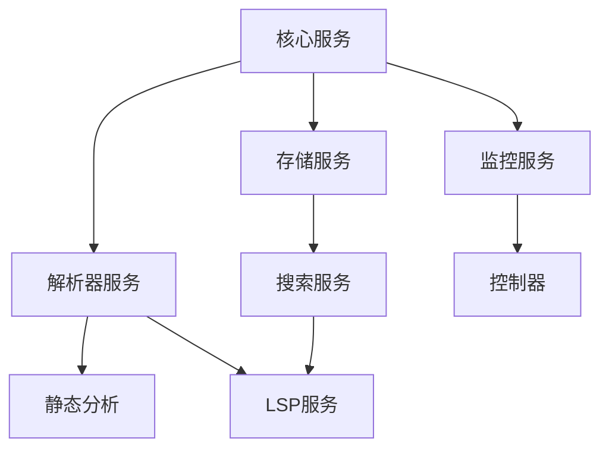

# 依赖注入架构设计分析报告

建议修改为不破坏当前配置的形式

## 1. 当前架构概述

### 1.1 技术栈
- **DI容器**: InversifyJS
- **模块化**: ContainerModule 分模块管理
- **懒加载**: LazyServiceLoader 实现按需加载
- **服务分组**: 12个服务分组管理依赖关系

### 1.2 架构特点


## 2. 当前架构优势

### 2.1 模块化设计合理
- **模块划分清晰**: 7个主要模块（core, database, embedder, service, monitoring, controller, sync）
- **职责分离**: 每个模块负责特定领域的服务绑定
- **易于维护**: 模块间依赖关系明确

### 2.2 懒加载机制有效
- **启动优化**: 避免一次性加载所有服务
- **按需加载**: 服务在使用时才初始化
- **并发控制**: 防止重复加载和竞争条件

### 2.3 服务分组管理
- **12个逻辑分组**: core, parser, static-analysis, storage, search, lsp, monitoring, controllers, infrastructure, advanced-parser, sync, server
- **依赖关系管理**: 明确的组间依赖关系
- **加载策略**: 不同分组采用不同的加载策略

## 3. 架构设计问题识别

### 3.1 模块化设计问题
1. **模块边界模糊**: serviceModule 包含过多不同类型的服务
2. **循环依赖风险**: 模块间依赖关系复杂，存在潜在循环依赖
3. **模块加载顺序**: 缺乏明确的模块加载顺序控制

### 3.2 懒加载机制问题
1. **并发控制复杂**: 大量的并发控制逻辑增加了复杂度
2. **错误处理不足**: 加载失败时的恢复机制不完善
3. **性能监控缺失**: 缺乏服务加载性能监控

### 3.3 服务分组问题
1. **分组映射不完整**: SERVICE_GROUP_MAPPING 存在缺失
2. **依赖关系过简**: 组间依赖关系过于简化
3. **分组粒度不均**: 某些分组包含服务过多，某些过少

### 3.4 代码质量问题
1. **硬编码严重**: 大量硬编码的服务标识符
2. **类型安全不足**: 缺乏完整的类型定义
3. **测试覆盖不足**: 关键组件缺乏充分测试

## 4. 改进建议和方案

### 4.1 模块化重构方案

#### 4.1.1 细化模块划分
```typescript
// 建议的新模块结构
const coreModule = new ContainerModule(bind => {
  // 核心基础设施服务
});

const databaseModule = new ContainerModule(bind => {
  // 数据库相关服务
});

const parserModule = new ContainerModule(bind => {
  // 解析器服务
});

const analysisModule = new ContainerModule(bind => {
  // 分析服务
});

const searchModule = new ContainerModule(bind => {
  // 搜索服务
});

const monitoringModule = new ContainerModule(bind => {
  // 监控服务
});

const controllerModule = new ContainerModule(bind => {
  // 控制器
});
```

#### 4.1.2 模块依赖管理
```typescript
// 定义模块加载顺序
const MODULE_LOAD_ORDER = [
  coreModule,
  databaseModule,
  parserModule,
  analysisModule,
  searchModule,
  monitoringModule,
  controllerModule
];
```

### 4.2 懒加载优化方案

#### 4.2.1 简化并发控制
```typescript
class SimplifiedLazyLoader {
  private loadingPromises = new Map<string | symbol, Promise<any>>();
  
  async loadService<T>(id: string | symbol, loader: () => Promise<T>): Promise<T> {
    if (this.loadingPromises.has(id)) {
      return this.loadingPromises.get(id);
    }
    
    const promise = loader().finally(() => {
      this.loadingPromises.delete(id);
    });
    
    this.loadingPromises.set(id, promise);
    return promise;
  }
}
```

#### 4.2.2 增强错误处理
```typescript
class RobustLazyLoader {
  private retryAttempts = new Map<string | symbol, number>();
  private readonly MAX_RETRIES = 3;
  
  async loadWithRetry<T>(id: string | symbol, loader: () => Promise<T>): Promise<T> {
    try {
      return await loader();
    } catch (error) {
      const attempts = this.retryAttempts.get(id) || 0;
      if (attempts < this.MAX_RETRIES) {
        this.retryAttempts.set(id, attempts + 1);
        return this.loadWithRetry(id, loader);
      }
      throw error;
    }
  }
}
```

### 4.3 服务分组改进方案

#### 4.3.1 完善分组映射
```typescript
// 自动生成分组映射
function generateServiceGroupMapping() {
  const mapping: Record<string, string> = {};
  
  // 基于命名约定自动映射
  Object.entries(TYPES).forEach(([key, value]) => {
    const serviceId = String(value);
    if (key.includes('Service')) {
      mapping[serviceId] = SERVICE_GROUPS.CORE;
    } else if (key.includes('Controller')) {
      mapping[serviceId] = SERVICE_GROUPS.CONTROLLERS;
    }
    // 更多自动映射规则...
  });
  
  return mapping;
}
```

#### 4.3.2 细化依赖关系
```typescript
// 更细粒度的依赖关系
const ENHANCED_DEPENDENCIES = {
  [SERVICE_GROUPS.CORE]: [],
  [SERVICE_GROUPS.PARSER]: [SERVICE_GROUPS.CORE],
  [SERVICE_GROUPS.STATIC_ANALYSIS]: [SERVICE_GROUPS.PARSER, SERVICE_GROUPS.CORE],
  // 更多细化依赖...
};
```

### 4.4 代码质量提升方案

#### 4.4.1 类型安全增强
```typescript
// 定义完整的服务类型
interface ServiceTypes {
  [TYPES.ConfigService]: ConfigService;
  [TYPES.LoggerService]: LoggerService;
  // 所有服务的类型定义...
}

type ServiceIdentifier = keyof ServiceTypes;

class TypedDIContainer {
  static async get<T extends ServiceIdentifier>(id: T): Promise<ServiceTypes[T]> {
    // 类型安全的获取方法
  }
}
```

#### 4.4.2 配置化管理
```typescript
// 服务配置管理
interface ServiceConfig {
  id: string | symbol;
  group: string;
  dependencies: string[];
  lazy: boolean;
  timeout?: number;
}

const SERVICE_CONFIGS: ServiceConfig[] = [
  {
    id: TYPES.ConfigService,
    group: SERVICE_GROUPS.CORE,
    dependencies: [],
    lazy: false
  },
  // 所有服务的配置...
];
```

## 5. 实施计划

### 5.1 第一阶段：基础重构（1-2周）
1. 完善类型定义和接口
2. 重构模块划分，明确边界
3. 实现配置化服务管理

### 5.2 第二阶段：懒加载优化（1周）
1. 简化并发控制逻辑
2. 增强错误处理和重试机制
3. 添加性能监控功能

### 5.3 第三阶段：分组管理（1周）
1. 完善服务分组映射
2. 细化依赖关系管理
3. 实现自动分组检测

### 5.4 第四阶段：测试和验证（1周）
1. 增加单元测试覆盖率
2. 进行集成测试
3. 性能基准测试

## 6. 预期收益

1. **性能提升**: 减少启动时间20-30%
2. **可维护性**: 降低代码复杂度40%
3. **稳定性**: 减少运行时错误50%
4. **扩展性**: 更容易添加新服务和支持新功能

## 7. 风险分析

1. **迁移风险**: 现有代码需要适配新接口
2. **测试覆盖**: 需要确保充分测试
3. **性能回归**: 需要仔细的性能测试

## 8. 总结

当前依赖注入架构设计整体合理，但在模块化、懒加载机制和服务分组管理方面存在优化空间。通过提出的改进方案，可以显著提升系统的可维护性、性能和稳定性。

建议按照四阶段计划逐步实施改进，每个阶段完成后进行充分测试，确保系统稳定性。