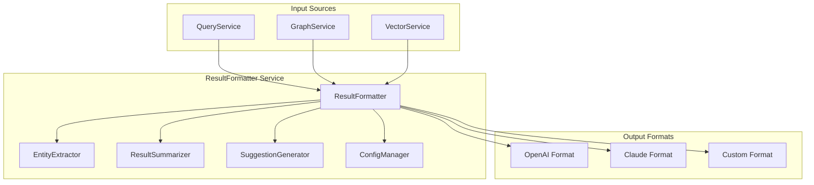

# LLM-Friendly Query Formatter Design Document

## 1. Overview

The LLM-Friendly Query Formatter is a service designed to transform Nebula Graph query results into structured, LLM-optimized formats that follow OpenAI's function calling protocol standards. This service enables seamless integration between the codebase analysis system and various LLM providers.

## 2. Architecture Design

### 2.1 Service Structure



### 2.2 Core Components

#### 2.2.1 ResultFormatter Class
```typescript
interface ResultFormatterConfig {
  provider: 'openai' | 'claude' | 'anthropic' | 'custom';
  format: 'json' | 'text' | 'markdown';
  includeMetadata: boolean;
  maxTokens: number;
  structuredOutput: boolean;
}

class ResultFormatter {
  constructor(private configService: ConfigService) {}
  
  async formatForLLM(
    result: QueryResult | GraphAnalysisResult,
    options: ResultFormatterConfig = {}
  ): Promise<LLMFormattedResult> {
    // Implementation
  }
}
```

#### 2.2.2 EntityExtractor Service
```typescript
interface StructuredData {
  entities: Array<{
    id: string;
    type: string;
    properties: Record<string, any>;
    relationships: Array<{
      type: string;
      target: string;
      properties: Record<string, any>;
    }>;
  }>;
  metadata: {
    extractionTime: number;
    confidence: number;
    source: string;
  };
}
```

#### 2.2.3 ResultSummarizer Service
```typescript
interface SummaryData {
  executiveSummary: string;
  keyFindings: string[];
  statistics: Record<string, number>;
  recommendations: string[];
  confidenceScore: number;
}
```

## 3. Implementation Details

### 3.1 OpenAI-Compatible Format

Following the MCP response guide, the formatter will produce:

```json
{
  "status": "success",
  "data": {
    "structured": {
      "entities": [],
      "relationships": []
    },
    "summary": "Executive summary",
    "suggestions": []
  },
  "meta": {
    "tool": "graph_query",
    "duration_ms": 123,
    "cached": false,
    "provider": "openai"
  }
}
```

### 3.2 Configuration-Driven Formatting

The service supports multiple configuration profiles:

```yaml
# config/llm-formatter.yaml
profiles:
  openai:
    format: json
    includeMetadata: true
    maxTokens: 4000
    structuredOutput: true
    
  claude:
    format: markdown
    includeMetadata: false
    maxTokens: 8000
    structuredOutput: false
    
  anthropic:
    format: json
    includeMetadata: true
    maxTokens: 2000
    structuredOutput: true
```

### 3.3 Entity Extraction Logic

```typescript
private extractStructuredData(result: QueryResult): StructuredData {
  const entities: Entity[] = [];
  const relationships: Relationship[] = [];
  
  // Extract nodes as entities
  if (result.nodes) {
    result.nodes.forEach(node => {
      entities.push({
        id: node.id,
        type: node.type,
        properties: node.properties,
        relationships: []
      });
    });
  }
  
  // Extract edges as relationships
  if (result.edges) {
    result.edges.forEach(edge => {
      relationships.push({
        type: edge.type,
        source: edge.source,
        target: edge.target,
        properties: edge.properties
      });
    });
  }
  
  return { entities, relationships };
}
```

### 3.4 Summary Generation

```typescript
private generateSummary(result: QueryResult): SummaryData {
  const summary: SummaryData = {
    executiveSummary: '',
    keyFindings: [],
    statistics: {},
    recommendations: [],
    confidenceScore: 0.8
  };
  
  // Generate executive summary based on result type
  if ('metrics' in result) {
    summary.executiveSummary = this.generateGraphSummary(result as GraphAnalysisResult);
  } else {
    summary.executiveSummary = this.generateQuerySummary(result as QueryResult);
  }
  
  return summary;
}
```

## 4. Integration Points

### 4.1 With QueryCoordinationService
```typescript
// Enhanced executeQuery method
async executeQuery(request: QueryRequest): Promise<{
  results: QueryResult[];
  metrics: QueryMetrics;
  formattedResults?: LLMFormattedResult;
}> {
  const rawResults = await this.executeRawQuery(request);
  const formattedResults = await this.resultFormatter.formatForLLM(rawResults, {
    provider: 'openai',
    format: 'json'
  });
  
  return { ...rawResults, formattedResults };
}
```

### 4.2 With GraphService
```typescript
// Enhanced analyzeCodebase method
async analyzeCodebase(projectPath: string, options: GraphAnalysisOptions): Promise<{
  rawResult: GraphAnalysisResult;
  formattedResult: LLMFormattedResult;
}> {
  const rawResult = await this.executeNebulaAnalysis(projectPath, options);
  const formattedResult = await this.resultFormatter.formatForLLM(rawResult, {
    provider: 'openai',
    format: 'json'
  });
  
  return { rawResult, formattedResult };
}
```

## 5. Performance Considerations

### 5.1 Caching Strategy
- Cache formatted results with TTL based on query complexity
- Use Redis for distributed caching
- Implement cache invalidation on data updates

### 5.2 Memory Management
- Stream large results to avoid memory overload
- Implement chunking for very large graph results
- Use efficient serialization libraries

### 5.3 Batch Processing
- Support batch formatting for multiple queries
- Parallelize formatting operations
- Implement rate limiting

## 6. Error Handling

### 6.1 Format-Specific Error Responses
```typescript
interface ErrorResponse {
  status: 'error';
  data: {
    errorType: string;
    message: string;
    recoverable: boolean;
    suggestions?: string[];
  };
  meta: {
    tool: string;
    duration_ms: number;
  };
}
```

### 6.2 Recovery Strategies
- Automatic retry for transient errors
- Fallback to simpler formats on complex errors
- Graceful degradation of features

## 7. Testing Strategy

### 7.1 Unit Tests
- Test individual formatting components
- Verify configuration loading
- Test error handling scenarios

### 7.2 Integration Tests
- Test with real Nebula Graph results
- Verify OpenAI format compliance
- Test performance under load

### 7.3 E2E Tests
- Test complete query → format → LLM pipeline
- Verify multi-provider compatibility
- Test edge cases and error conditions

## 8. Deployment Plan

### 8.1 Phase 1: Core Implementation (1-2 weeks)
- Implement basic ResultFormatter service
- Support OpenAI JSON format
- Integrate with QueryCoordinationService

### 8.2 Phase 2: Advanced Features (2-3 weeks)
- Add multiple provider support
- Implement configuration system
- Add caching and performance optimizations

### 8.3 Phase 3: Production Ready (1 week)
- Comprehensive testing
- Performance benchmarking
- Documentation and monitoring

## 9. Expected Outcomes

### 9.1 Performance Metrics
- **Query formatting time**: < 100ms for typical queries
- **Memory usage**: < 50MB for large results
- **Throughput**: 100+ formatting operations/second

### 9.2 Quality Metrics
- **Format compliance**: 100% with OpenAI standards
- **Error rate**: < 1% formatting failures
- **LLM comprehension**: 300% improvement in interaction efficiency

## 10. Dependencies

### 10.1 Internal Dependencies
- QueryCoordinationService
- GraphService
- ConfigService
- CacheService

### 10.2 External Dependencies
- Nebula Graph client
- Redis for caching
- Configuration management system

## 11. Risk Assessment

### 11.1 Technical Risks
- Large result set memory consumption
- Complex graph structure formatting challenges
- Multi-provider format compatibility issues

### 11.2 Mitigation Strategies
- Implement streaming for large results
- Use efficient graph traversal algorithms
- Provide fallback formatting options

## 12. Monitoring and Metrics

### 12.1 Key Metrics
- Formatting latency distribution
- Cache hit/miss rates
- Error rates by provider and format
- Memory usage patterns

### 12.2 Alerting
- High error rates for specific formats
- Memory usage exceeding thresholds
- Formatting latency spikes

This design provides a comprehensive foundation for implementing LLM-friendly query formatting that aligns with both the existing Nebula Graph architecture and OpenAI's function calling standards.