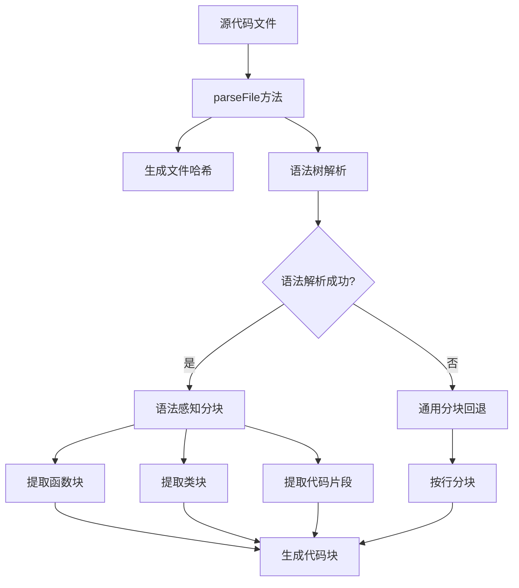

# 向量嵌入模块分块机制分析

## 概述

本文档详细分析当前向量嵌入模块在嵌入模型处理前的代码分块机制。基于 `SmartCodeParser` 类的实现，分块过程采用智能语法感知策略，结合通用分块回退机制。

## 分块架构

### 核心组件
- **SmartCodeParser**: 主解析器类，负责文件解析和分块
- **TreeSitterService**: 语法树解析服务，支持多语言AST分析
- **ChunkingOptions**: 分块配置选项，控制分块行为

### 分块流程


## 语法感知分块策略

### 1. 函数块提取 (`createFunctionChunks`)
```typescript
// 提取AST中的函数节点
const functions = this.treeSitterService.extractFunctions(parseResult.ast);

// 为每个函数创建代码块
for (const funcNode of functions) {
    const funcContent = this.treeSitterService.getNodeText(funcNode, content);
    const location = this.treeSitterService.getNodeLocation(funcNode);
    
    const chunk: CodeChunk = {
        id: this.generateChunkId(funcContent, location.startLine),
        content: funcContent,
        startLine: location.startLine,
        endLine: location.endLine,
        type: 'function',
        functionName: this.extractFunctionName(funcNode, content),
        metadata: {
            parameters: this.extractParameters(funcNode, content),
            returnType: this.extractReturnType(funcNode, content),
            complexity: this.calculateComplexity(funcContent)
        }
    };
}
```

### 2. 类块提取 (`createClassChunks`)
```typescript
// 提取AST中的类节点
const classes = this.treeSitterService.extractClasses(parseResult.ast);

// 为每个类创建代码块
for (const classNode of classes) {
    const classContent = this.treeSitterService.getNodeText(classNode, content);
    const location = this.treeSitterService.getNodeLocation(classNode);
    
    const chunk: CodeChunk = {
        id: this.generateChunkId(classContent, location.startLine),
        content: classContent,
        startLine: location.startLine,
        endLine: location.endLine,
        type: 'class',
        className: this.extractClassName(classNode, content),
        metadata: {
            methods: this.extractMethods(classNode, content).length,
            properties: this.extractProperties(classNode, content).length,
            inheritance: this.extractInheritance(classNode, content),
            complexity: this.calculateComplexity(classContent)
        }
    };
}
```

## 通用分块回退机制

当语法解析失败或不支持时，采用基于行的通用分块策略 (`createGenericChunks`):

```typescript
private createGenericChunks(content: string, options: Required<ChunkingOptions>): CodeChunk[] {
    const chunks: CodeChunk[] = [];
    const lines = content.split('\n');
    let currentChunk: string[] = [];
    let currentLine = 1;

    for (let i = 0; i < lines.length; i++) {
        const line = lines[i];
        currentChunk.push(line);

        // 检查是否达到最大分块大小或文件末尾
        if (currentChunk.join('\n').length >= options.maxChunkSize || i === lines.length - 1) {
            const chunkContent = currentChunk.join('\n');
            
            // 创建分块（满足最小大小或是最后一个分块）
            if (chunkContent.length >= options.minChunkSize || (i === lines.length - 1 && chunks.length === 0)) {
                const chunk: CodeChunk = {
                    id: this.generateChunkId(chunkContent, currentLine),
                    content: chunkContent,
                    startLine: currentLine,
                    endLine: currentLine + currentChunk.length - 1,
                    type: 'generic',
                    metadata: {
                        lineCount: currentChunk.length,
                        complexity: this.calculateComplexity(chunkContent)
                    }
                };
                chunks.push(chunk);
            }

            currentChunk = [];
            currentLine = i + 1;
        }
    }
    return chunks;
}
```

## 分块配置选项

默认分块参数 (`ChunkingOptions`):

| 参数 | 默认值 | 描述 |
|------|--------|------|
| maxChunkSize | 1000 | 最大分块字符数 |
| overlapSize | 200 | 重叠字符数（暂未使用） |
| preserveFunctionBoundaries | true | 保持函数边界 |
| preserveClassBoundaries | true | 保持类边界 |
| includeComments | false | 包含注释 |
| minChunkSize | 100 | 最小分块字符数 |
| extractSnippets | true | 提取代码片段 |

## 多语言支持

通过 TreeSitterService 支持多种编程语言：
- TypeScript/JavaScript
- Python
- Java
- Go
- Rust
- C/C++
- Markdown（特殊处理）

## Markdown 特殊处理

Markdown 文件采用标题结构分段处理：
1. 提取标题结构 (`extractHeadings`)
2. 处理标题前内容
3. 按标题级别分段处理内容
4. 生成 `markdown_header_h1`, `markdown_header_h2` 等类型代码块

## 哈希去重机制

使用 SHA256 哈希算法进行内容去重：

```typescript
private generateChunkId(content: string, startLine: number): string {
    const contentHash = createHash('md5').update(content).digest('hex').substring(0, 8);
    return `chunk_${startLine}_${contentHash}`;
}

private generateFileId(filePath: string, hash: string): string {
    const pathHash = createHash('md5').update(filePath).digest('hex').substring(0, 8);
    return `file_${pathHash}_${hash.substring(0, 8)}`;
}
```

## 元数据提取

### 函数元数据
- 函数名称
- 参数列表
- 返回类型
- 代码复杂度

### 类元数据
- 类名称
- 方法数量
- 属性数量
- 继承关系
- 代码复杂度

### 通用元数据
- 行数统计
- 代码复杂度

## 复杂度计算

使用正则表达式模式匹配计算代码复杂度：

```typescript
private calculateComplexity(code: string): number {
    const combinedPattern = /\b(if|else|for|while|switch|case|try|catch)\b|\?\.|&&|\|\|/g;
    let complexity = 1;
    let match;
    
    while ((match = combinedPattern.exec(code)) !== null) {
        complexity++;
    }
    return complexity;
}
```

## 性能优化

1. **解析器缓存**: 避免重复加载同一语言解析器
2. **批量处理**: 减少API调用次数
3. **哈希优化**: 使用MD5哈希替代SHA256提高性能
4. **正则预编译**: 预编译复杂度计算正则表达式

## 错误处理

- 语法解析失败时自动回退到通用分块
- 捕获并记录解析错误
- 确保即使部分失败也能继续处理

## 总结

当前向量嵌入模块采用智能语法感知分块策略，优先保持代码逻辑完整性，在语法解析失败时回退到基于行的通用分块。这种分层策略确保了分块的准确性和鲁棒性，为后续的嵌入处理提供了高质量的结构化代码块数据。