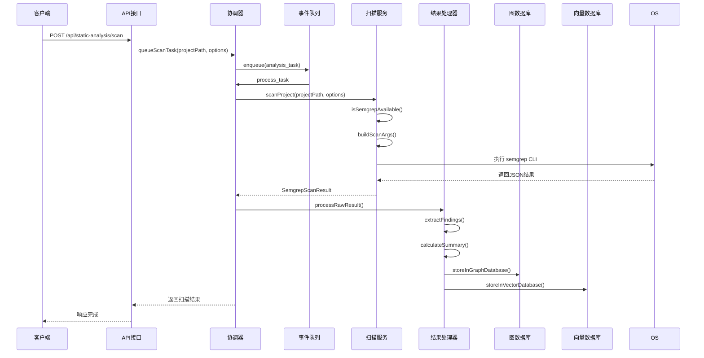
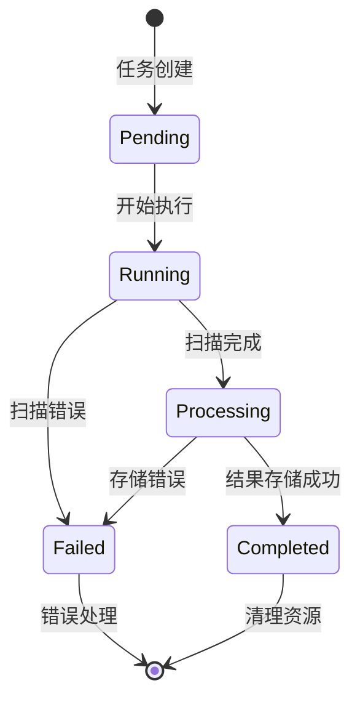
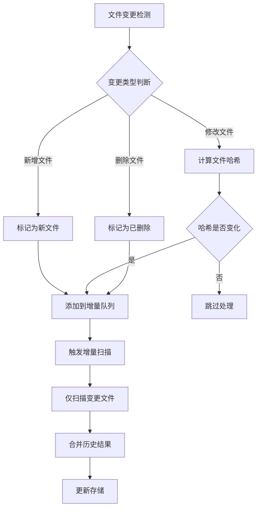
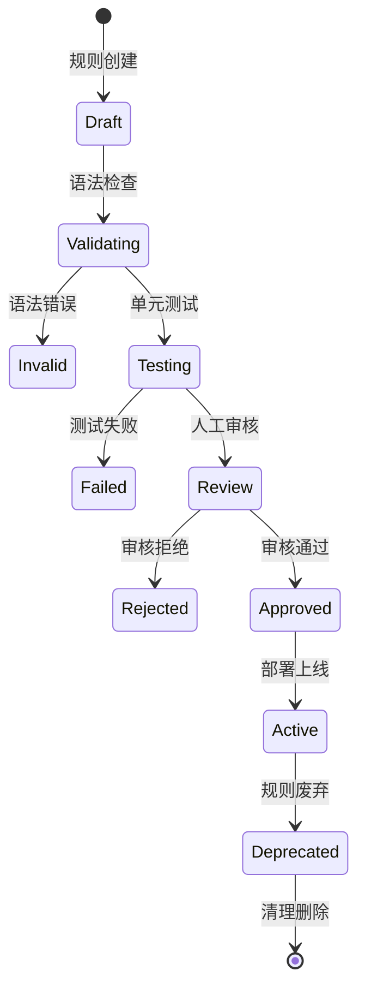
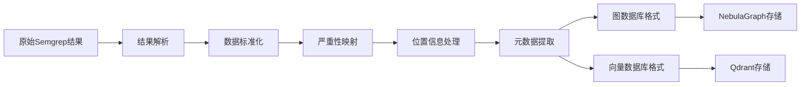
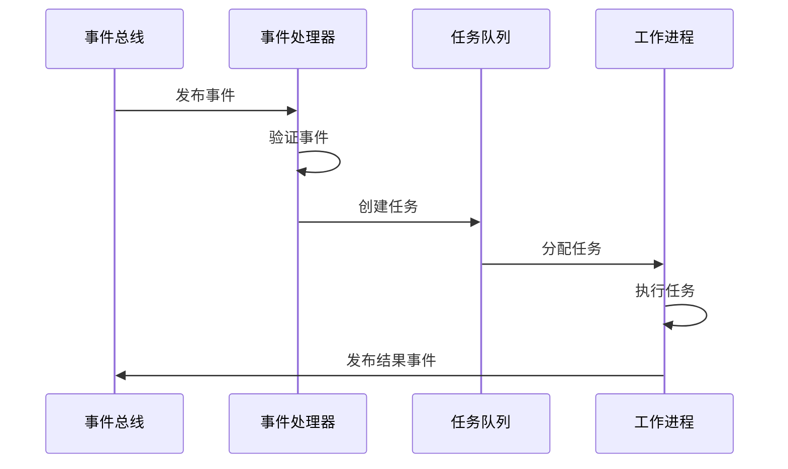

# Semgrep模块工作流与流程文档

## 工作流总览

Semgrep模块采用事件驱动的异步工作流设计，通过消息队列实现松耦合的组件间通信，支持实时、批量和增量三种扫描模式。

## 核心工作流

### 1. 完整项目扫描工作流

#### 1.1 触发条件
- 项目首次索引完成
- 手动触发全量扫描
- 定时任务触发
- Webhook事件触发

#### 1.2 详细流程



#### 1.3 状态流转



### 2. 增量扫描工作流

#### 2.1 触发机制
- 文件系统监控事件
- Git提交钩子
- IDE插件事件
- 代码审查触发

#### 2.2 变更检测流程



#### 2.3 智能过滤策略

```typescript
interface IncrementalFilter {
  // 文件大小过滤
  maxFileSize: number;        // 最大文件大小(1MB)
  
  // 文件类型过滤
  supportedExtensions: string[]; // ['.js', '.ts', '.py', ...]
  
  // 路径过滤
  excludePatterns: RegExp[];   // [/^node_modules/, /^\.git/]
  
  // 内容过滤
  ignoreMinified: boolean;     // 忽略压缩文件
  ignoreGenerated: boolean;    // 忽略生成文件
  
  // 变更频率过滤
  debounceMs: number;         // 防抖时间(1000ms)
  maxChangesPerFile: number;   // 单文件最大变更次数
}
```

### 3. 规则管理工作流

#### 3.1 规则生命周期



#### 3.2 规则验证流程

```typescript
class RuleValidationWorkflow {
  async validateRule(rule: SemgrepRule): Promise<ValidationResult> {
    // 1. 语法验证
    const syntaxCheck = await this.validateSyntax(rule);
    if (!syntaxCheck.valid) {
      return { valid: false, errors: syntaxCheck.errors };
    }
    
    // 2. 语义验证
    const semanticCheck = await this.validateSemantics(rule);
    if (!semanticCheck.valid) {
      return { valid: false, errors: semanticCheck.errors };
    }
    
    // 3. 性能测试
    const performanceCheck = await this.testPerformance(rule);
    if (performanceCheck.duration > 1000) {
      return { valid: false, errors: ['Rule too slow'] };
    }
    
    // 4. 准确性测试
    const accuracyCheck = await this.testAccuracy(rule);
    if (accuracyCheck.falsePositiveRate > 0.05) {
      return { valid: false, errors: ['High false positive rate'] };
    }
    
    return { valid: true, errors: [] };
  }
}
```

### 4. 结果处理工作流

#### 4.1 结果转换流程



#### 4.2 数据标准化处理

```typescript
class ResultNormalization {
  normalizeFinding(rawFinding: any): SemgrepFinding {
    return {
      id: this.generateFindingId(rawFinding),
      ruleId: rawFinding.check_id,
      message: this.extractMessage(rawFinding),
      severity: this.mapSeverity(rawFinding.extra?.severity),
      confidence: this.calculateConfidence(rawFinding),
      location: this.normalizeLocation(rawFinding),
      cwe: this.extractCwe(rawFinding.extra?.metadata),
      owasp: this.extractOwasp(rawFinding.extra?.metadata),
      fix: this.extractFix(rawFinding.extra?.fix),
      metadata: this.extractMetadata(rawFinding)
    };
  }
  
  private generateFindingId(finding: any): string {
    const hash = crypto.createHash('sha256');
    hash.update(`${finding.check_id}:${finding.path}:${finding.start.line}`);
    return hash.digest('hex').substring(0, 16);
  }
}
```

#### 4.3 图数据库存储流程

```typescript
class GraphStorageWorkflow {
  async storeInGraphDatabase(findings: SemgrepFinding[]): Promise<void> {
    const session = this.nebulaService.getSession();
    
    try {
      // 1. 创建扫描节点
      const scanId = await this.createScanNode(session);
      
      // 2. 批量创建发现节点
      const findingNodes = findings.map(finding => ({
        id: `finding_${finding.id}`,
        label: 'SemgrepFinding',
        properties: {
          ruleId: finding.ruleId,
          severity: finding.severity,
          message: finding.message,
          filePath: finding.location.file,
          lineNumber: finding.location.start.line,
          timestamp: new Date().toISOString()
        }
      }));
      
      await this.batchCreateNodes(session, findingNodes);
      
      // 3. 创建关联关系
      const relationships = findings.map(finding => ({
        from: scanId,
        to: `finding_${finding.id}`,
        type: 'FOUND',
        properties: { confidence: finding.confidence }
      }));
      
      await this.batchCreateRelationships(session, relationships);
      
    } finally {
      session.close();
    }
  }
}
```

### 5. 事件驱动架构

#### 5.1 事件类型定义

```typescript
interface AnalysisEvents {
  'file:changed': {
    projectPath: string;
    filePath: string;
    changeType: 'added' | 'modified' | 'deleted';
    fileSize: number;
    checksum: string;
  };
  
  'project:indexed': {
    projectPath: string;
    fileCount: number;
    totalSize: number;
    indexingTime: number;
  };
  
  'scan:started': {
    scanId: string;
    projectPath: string;
    rules: string[];
    timestamp: Date;
  };
  
  'scan:completed': {
    scanId: string;
    projectPath: string;
    findings: number;
    duration: number;
    timestamp: Date;
  };
  
  'scan:failed': {
    scanId: string;
    projectPath: string;
    error: string;
    timestamp: Date;
  };
}
```

#### 5.2 事件处理流程



### 6. 错误处理与重试机制

#### 6.1 错误分类与处理

```typescript
enum AnalysisErrorType {
  SCAN_FAILED = 'scan_failed',
  PARSE_ERROR = 'parse_error',
  STORAGE_ERROR = 'storage_error',
  NETWORK_ERROR = 'network_error',
  TIMEOUT_ERROR = 'timeout_error',
  VALIDATION_ERROR = 'validation_error'
}

class ErrorHandler {
  async handleError(error: AnalysisError, context: AnalysisContext): Promise<void> {
    switch (error.type) {
      case AnalysisErrorType.SCAN_FAILED:
        await this.handleScanFailed(error, context);
        break;
      case AnalysisErrorType.STORAGE_ERROR:
        await this.handleStorageError(error, context);
        break;
      case AnalysisErrorType.TIMEOUT_ERROR:
        await this.handleTimeoutError(error, context);
        break;
      default:
        await this.handleGenericError(error, context);
    }
  }
  
  private async handleScanFailed(error: AnalysisError, context: AnalysisContext): Promise<void> {
    const retryCount = context.metadata?.retryCount || 0;
    
    if (retryCount < 3) {
      // 指数退避重试
      const delay = Math.pow(2, retryCount) * 1000;
      await this.scheduleRetry(context, delay, retryCount + 1);
    } else {
      // 记录失败并告警
      await this.recordFailure(context);
      await this.sendAlert(context);
    }
  }
}
```

#### 6.2 重试策略配置

```typescript
interface RetryConfig {
  maxRetries: number;           // 最大重试次数：3
  initialDelay: number;        // 初始延迟：1000ms
  maxDelay: number;            // 最大延迟：30000ms
  backoffMultiplier: number;   // 退避倍数：2
  jitter: boolean;             // 随机抖动：true
}

const defaultRetryConfig: RetryConfig = {
  maxRetries: 3,
  initialDelay: 1000,
  maxDelay: 30000,
  backoffMultiplier: 2,
  jitter: true
};
```

### 7. 性能监控工作流

#### 7.1 监控数据采集

```typescript
class PerformanceMonitor {
  async collectMetrics(scanId: string, context: ScanContext): Promise<void> {
    const metrics = {
      scanId,
      projectPath: context.projectPath,
      duration: Date.now() - context.startTime,
      fileCount: context.files.length,
      totalSize: context.totalSize,
      ruleCount: context.rules.length,
      findingCount: context.findings.length,
      errorCount: context.errors.length,
      memoryUsage: process.memoryUsage(),
      cpuUsage: process.cpuUsage()
    };
    
    await this.storeMetrics(metrics);
    await this.checkThresholds(metrics);
  }
  
  private async checkThresholds(metrics: ScanMetrics): Promise<void> {
    const thresholds = {
      maxDuration: 300000,      // 5分钟
      maxMemory: 2147483648,    // 2GB
      maxErrorRate: 0.1        // 10%
    };
    
    if (metrics.duration > thresholds.maxDuration) {
      await this.sendAlert('scan_duration_exceeded', metrics);
    }
    
    if (metrics.memoryUsage.heapUsed > thresholds.maxMemory) {
      await this.sendAlert('memory_usage_exceeded', metrics);
    }
  }
}
```

#### 7.2 实时监控仪表板

```typescript
class MonitoringDashboard {
  async getRealTimeStats(): Promise<AnalysisStats> {
    return {
      activeScans: await this.getActiveScanCount(),
      queueSize: await this.getQueueSize(),
      successRate: await this.calculateSuccessRate(),
      avgDuration: await this.calculateAverageDuration(),
      topRules: await this.getTopRulesByUsage(),
      recentErrors: await this.getRecentErrors()
    };
  }
}
```

### 8. 批量处理工作流

#### 8.1 批量扫描策略

```typescript
class BatchProcessor {
  async processBatch(projects: string[]): Promise<BatchResult> {
    const batches = this.createBatches(projects, {
      maxBatchSize: 5,          // 每批最多5个项目
      maxConcurrentBatches: 2,  // 最多2个并发批次
      projectTimeout: 300000    // 单个项目超时5分钟
    });
    
    const results: BatchResult[] = [];
    
    for (const batch of batches) {
      const batchResults = await Promise.allSettled(
        batch.map(project => this.processProject(project))
      );
      
      results.push(...batchResults);
      
      // 批次间延迟
      await this.delay(1000);
    }
    
    return this.aggregateResults(results);
  }
  
  private createBatches(
    projects: string[], 
    config: BatchConfig
  ): string[][] {
    const batches: string[][] = [];
    
    for (let i = 0; i < projects.length; i += config.maxBatchSize) {
      batches.push(projects.slice(i, i + config.maxBatchSize));
    }
    
    return batches;
  }
}
```

### 9. 清理与维护工作流

#### 9.1 定期清理任务

```typescript
class MaintenanceWorkflow {
  async runMaintenance(): Promise<void> {
    await this.cleanupOldResults();
    await this.optimizeDatabase();
    await this.validateRules();
    await this.updateMetrics();
  }
  
  private async cleanupOldResults(): Promise<void> {
    const cutoffDate = new Date(Date.now() - 30 * 24 * 60 * 60 * 1000); // 30天前
    
    await this.nebulaService.executeQuery(`
      MATCH (scan:semgrep_scan)
      WHERE scan.timestamp < $cutoffDate
      DELETE scan
    `, { cutoffDate });
    
    await this.qdrantService.deleteOldPoints(cutoffDate);
  }
  
  private async validateRules(): Promise<void> {
    const rules = await this.ruleAdapter.getAllRules();
    
    for (const rule of rules) {
      const validation = await this.ruleAdapter.validateRule(rule);
      if (!validation.valid) {
        await this.markRuleAsInvalid(rule.id, validation.errors);
      }
    }
  }
}
```

## 工作流配置示例

### 配置文件模板

```yaml
# config/workflows/semgrep-workflows.yml
workflows:
  full_scan:
    enabled: true
    schedule: "0 2 * * *"  # 每天凌晨2点
    batch_size: 10
    timeout: 300
    retry_config:
      max_retries: 3
      backoff: exponential
      
  incremental_scan:
    enabled: true
    triggers:
      - file_change
      - git_commit
    debounce_ms: 1000
    max_concurrent: 2
    
  rule_validation:
    enabled: true
    schedule: "0 3 * * 0"  # 每周日凌晨3点
    timeout: 600
    
  cleanup:
    enabled: true
    schedule: "0 4 * * 0"  # 每周日凌晨4点
    retention_days: 30
```

---

*文档版本：v1.0.0*
*最后更新：2025-01-16*
*维护团队：codebase-index项目组*