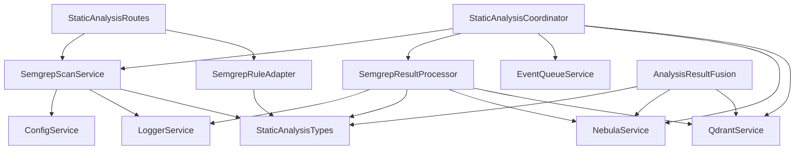

# Semgrep模块文件作用说明

## 目录结构

```
src/services/semgrep/
├── SemgrepScanService.ts          # 核心扫描服务
├── SemgrepResultProcessor.ts      # 结果处理器
├── SemgrepRuleAdapter.ts          # 规则适配器
└── test/                          # 单元测试
    ├── SemgrepScanService.test.ts
    ├── SemgrepResultProcessor.test.ts
    └── SemgrepRuleAdapter.test.ts

src/services/static-analysis/
├── StaticAnalysisCoordinator.ts   # 协调器服务
├── AnalysisResultFusion.ts        # 结果融合器
└── index.ts                       # 导出接口

src/models/
├── StaticAnalysisTypes.ts         # 数据模型定义
└── SemgrepResultTypes.ts          # Semgrep特定类型

src/config/
├── semgrep.config.ts              # Semgrep配置
└── ConfigService.ts              # 配置服务

src/api/routes/
└── StaticAnalysisRoutes.ts        # REST API路由

test/semgrep-test/
├── integration-test-report.md     # 集成测试报告
├── vulnerable.js                 # 测试用例
├── vulnerable.py                 # 测试用例
└── semgrep-rules/                # 测试规则
```

## 核心文件详细说明

### 1. SemgrepScanService.ts
**位置**: `src/services/semgrep/SemgrepScanService.ts`
**作用**: 核心扫描服务，负责与Semgrep CLI交互
**主要功能**:
- 执行项目级代码扫描
- 管理Semgrep CLI调用
- 处理扫描参数构建
- 错误处理和重试机制
- 扫描进度监控

**关键方法**:
```typescript
interface ISemgrepScanService {
  scanProject(projectPath: string, options?: SemgrepScanOptions): Promise<SemgrepScanResult>;
  addCustomRule(rule: SemgrepRule): Promise<void>;
  getAvailableRules(): Promise<SemgrepRule[]>;
  validateRule(rule: SemgrepRule): Promise<ValidationResult>;
  isSemgrepAvailable(): Promise<boolean>;
}
```

**依赖关系**:
- 依赖 `ConfigService` 获取配置参数
- 依赖 `LoggerService` 记录日志
- 使用 `child_process` 执行CLI命令
- 使用 `fs` 模块处理文件操作

### 2. SemgrepResultProcessor.ts
**位置**: `src/services/semgrep/SemgrepResultProcessor.ts`
**作用**: 结果处理器，负责解析和转换Semgrep输出
**主要功能**:
- 解析原始Semgrep JSON输出
- 标准化发现结果格式
- 生成统计摘要
- 转换为图数据库格式
- 转换为向量数据库格式

**关键方法**:
```typescript
class SemgrepResultProcessor {
  processRawResult(rawResult: any, projectPath: string): SemgrepScanResult;
  toGraphFormat(findings: SemgrepFinding[]): GraphData;
  toVectorFormat(findings: SemgrepFinding[]): VectorData;
  generateSummaryReport(result: SemgrepScanResult): SummaryReport;
}
```

**处理流程**:
1. **解析阶段**: 提取原始数据中的发现和错误
2. **标准化阶段**: 统一数据格式和字段
3. **转换阶段**: 生成不同存储格式
4. **摘要阶段**: 计算统计信息

### 3. SemgrepRuleAdapter.ts
**位置**: `src/services/semgrep/SemgrepRuleAdapter.ts`
**作用**: 规则适配器，负责规则格式转换和管理
**主要功能**:
- 内部规则格式转Semgrep格式
- 支持多种规则源格式
- 规则验证和测试
- 安全规则模板生成

**支持的规则格式**:
- Semgrep原生YAML格式
- ESLint规则格式
- SonarQube规则格式
- 自定义JSON格式

**关键方法**:
```typescript
class SemgrepRuleAdapter {
  adaptInternalRule(internalRule: any): SemgrepRule;
  adaptFromCommonFormat(source: 'eslint' | 'sonarqube', ruleData: any): SemgrepRule;
  validateRuleFormat(rule: SemgrepRule): ValidationResult;
  createSecurityRuleTemplates(): SemgrepRule[];
}
```

### 4. StaticAnalysisCoordinator.ts
**位置**: `src/services/static-analysis/StaticAnalysisCoordinator.ts`
**作用**: 协调器服务，管理整个分析流程
**主要功能**:
- 事件驱动的扫描触发
- 任务队列管理
- 结果持久化协调
- 增量扫描支持
- 并发控制

**事件处理**:
```typescript
eventQueue.on('file_changed', handleFileChange);
eventQueue.on('project_indexed', handleProjectIndexed);
```

**任务状态管理**:
- Pending → Running → Processing → Completed/Failed
- 支持任务取消和重试
- 实时状态查询

### 5. AnalysisResultFusion.ts
**位置**: `src/services/static-analysis/AnalysisResultFusion.ts`
**作用**: 结果融合器，增强分析结果
**主要功能**:
- 相似代码查找
- 修复示例推荐
- 影响范围分析
- 智能报告生成
- 历史趋势分析

**融合算法**:
- 基于向量搜索的相似代码发现
- 基于图数据库的依赖分析
- 基于历史数据的趋势预测

### 6. StaticAnalysisTypes.ts
**位置**: `src/models/StaticAnalysisTypes.ts`
**作用**: 数据模型定义，统一类型规范
**包含类型**:
- SemgrepScanResult: 扫描结果
- SemgrepFinding: 发现问题
- SemgrepRule: 规则定义
- SemgrepError: 错误信息
- SemgrepScanOptions: 扫描选项
- AnalysisTask: 分析任务

**设计原则**:
- 类型安全优先
- 字段命名统一
- 支持扩展字段
- JSON序列化友好

### 7. semgrep.config.ts
**位置**: `src/config/semgrep.config.ts`
**作用**: Semgrep专用配置管理
**配置项说明**:

| 配置项 | 类型 | 默认值 | 说明 |
|--------|------|--------|------|
| binaryPath | string | 'semgrep' | CLI可执行文件路径 |
| timeout | number | 30000 | 扫描超时时间(ms) |
| maxMemory | number | 512 | 最大内存使用(MB) |
| maxTargetBytes | number | 1000000 | 最大目标文件大小 |
| jobs | number | 4 | 并发作业数 |
| configPaths | string[] | ['auto', 'p/security-audit'] | 规则配置路径 |
| customRulesPath | string | './rules/semgrep' | 自定义规则目录 |
| excludePatterns | string[] | ['node_modules', '.git'] | 排除模式 |
| includePatterns | string[] | ['*.js', '*.ts', '*.py'] | 包含模式 |
| severityLevels | string[] | ['ERROR', 'WARNING', 'INFO'] | 严重性级别 |

### 8. StaticAnalysisRoutes.ts
**位置**: `src/api/routes/StaticAnalysisRoutes.ts`
**作用**: REST API路由定义
**提供接口**:

#### 扫描接口
- POST `/api/static-analysis/scan` - 触发扫描
- GET `/api/static-analysis/results/{project}` - 获取结果
- GET `/api/static-analysis/status/{scanId}` - 查询状态

#### 规则接口
- POST `/api/static-analysis/rules` - 创建规则
- GET `/api/static-analysis/rules` - 获取规则列表
- PUT `/api/static-analysis/rules/{ruleId}` - 更新规则
- DELETE `/api/static-analysis/rules/{ruleId}` - 删除规则

#### 报告接口
- GET `/api/static-analysis/report/{project}` - 生成报告
- GET `/api/static-analysis/summary/{project}` - 获取摘要
- GET `/api/static-analysis/trends/{project}` - 获取趋势

### 9. 测试文件说明

#### SemgrepScanService.test.ts
**测试内容**:
- CLI可用性检测
- 扫描参数构建
- 错误处理机制
- 并发扫描测试
- 超时处理测试

#### SemgrepResultProcessor.test.ts
**测试内容**:
- JSON解析正确性
- 数据格式转换
- 边界条件处理
- 错误数据恢复
- 性能基准测试

#### SemgrepRuleAdapter.test.ts
**测试内容**:
- 规则格式转换
- 验证逻辑正确性
- 模板生成功能
- 错误规则检测
- 兼容性测试

### 10. 配置文件说明

#### .env 环境变量
```bash
# Semgrep基础配置
SEMGREP_BINARY_PATH=/usr/local/bin/semgrep
SEMGREP_TIMEOUT=30000
SEMGREP_MAX_MEMORY=512
SEMGREP_JOBS=4

# 规则配置
SEMGREP_CONFIG_PATHS=auto,p/security-audit,p/secrets
SEMGREP_CUSTOM_RULES_PATH=./config/semgrep-rules

# 扫描配置
SEMGREP_EXCLUDE_PATTERNS=node_modules,.git,dist,build
SEMGREP_INCLUDE_PATTERNS=*.js,*.ts,*.py,*.java,*.go
SEMGREP_SEVERITY_LEVELS=ERROR,WARNING,INFO
```

#### static-analysis.json
```json
{
  "staticAnalysis": {
    "enabled": true,
    "defaultTool": "semgrep",
    "scanOnChange": true,
    "batchSize": 100,
    "resultRetentionDays": 30,
    "semgrep": {
      "enabled": true,
      "cliPath": "semgrep",
      "rulesDir": "./config/semgrep-rules",
      "defaultRules": ["p/security-audit", "p/secrets"],
      "timeout": 30000,
      "maxTargetBytes": 1000000,
      "maxConcurrentScans": 3,
      "cacheEnabled": true,
      "cacheTtl": 3600000
    }
  }
}
```

## 文件依赖图



## 扩展开发指南

### 1. 添加新规则格式支持

```typescript
// 在 SemgrepRuleAdapter.ts 中添加
class NewRuleAdapter {
  adaptNewFormat(ruleData: any): SemgrepRule {
    // 实现转换逻辑
  }
}
```

### 2. 扩展结果处理器

```typescript
// 在 SemgrepResultProcessor.ts 中添加
class CustomResultProcessor extends SemgrepResultProcessor {
  toCustomFormat(findings: SemgrepFinding[]): CustomFormat {
    // 实现自定义格式
  }
}
```

### 3. 添加新API端点

```typescript
// 在 StaticAnalysisRoutes.ts 中添加
router.post('/api/static-analysis/custom-endpoint', async (req, res) => {
  // 实现新功能
});
```

## 故障排查文件

### 1. 日志文件位置
- `logs/semgrep-scan.log` - 扫描日志
- `logs/semgrep-error.log` - 错误日志
- `logs/semgrep-performance.log` - 性能日志

### 2. 调试配置
```typescript
// 启用调试日志
DEBUG=semgrep:* npm run dev

// 详细错误信息
NODE_ENV=development npm run dev
```

### 3. 配置文件验证
```bash
# 验证配置文件
node scripts/validate-config.js

# 测试规则
semgrep --validate --config=config/semgrep-rules/
```

---

*文档版本：v1.0.0*
*最后更新：2025-01-16*
*维护团队：codebase-index项目组*