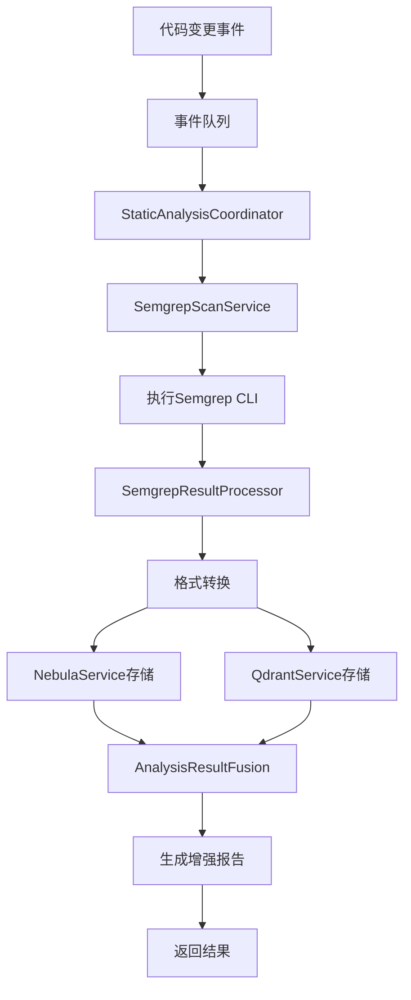
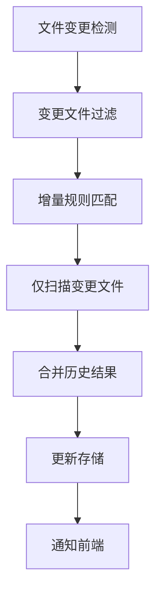
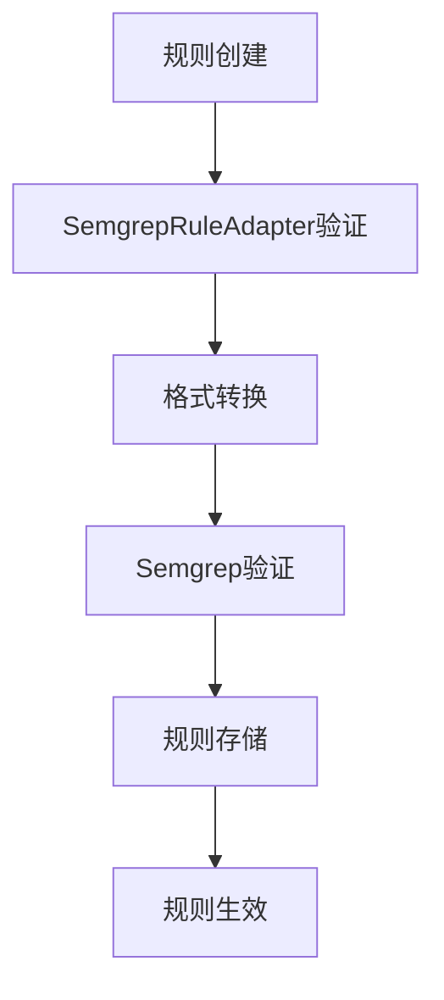

# Semgrep模块架构设计文档

## 概述

Semgrep模块是codebase-index项目中的静态代码分析子系统，基于开源的Semgrep工具实现轻量级但高效的代码安全扫描和分析能力。该模块采用模块化设计，与现有系统深度集成，提供实时代码安全检测和智能分析功能。

## 设计目标

### 核心目标
- **轻量级集成**：最小化系统开销，快速部署和使用
- **多语言支持**：支持JavaScript、TypeScript、Python、Java、Go等主流编程语言
- **实时检测**：代码变更时自动触发安全扫描
- **智能融合**：将静态分析结果与图数据库和向量搜索结合
- **可扩展性**：支持自定义规则和灵活配置

### 性能目标
- 单个项目扫描时间 < 5分钟
- 内存使用控制在500MB-2GB
- 误报率 < 3%，漏报率 < 5%
- 支持并发扫描3个项目

## 架构设计

### 整体架构

```
┌─────────────────────────────────────────────────────────────┐
│                    Semgrep模块架构                          │
├─────────────────────────────────────────────────────────────┤
│  API层                                                      │
│  ┌─────────────────┐  ┌─────────────────┐                  │
│  │ StaticAnalysis  │  │    Semgrep      │                  │
│  │    Routes       │  │     API         │                  │
│  └─────────────────┘  └─────────────────┘                  │
├─────────────────────────────────────────────────────────────┤
│  服务层                                                     │
│  ┌─────────────────┐  ┌─────────────────┐  ┌──────────────┐ │
│  │ StaticAnalysis  │  │   Semgrep       │  │ Semgrep      │ │
│  │ Coordinator     │  │ ScanService     │  │ResultProc.   │ │
│  └─────────────────┘  └─────────────────┘  └──────────────┘ │
│  ┌─────────────────┐  ┌─────────────────┐  ┌──────────────┐ │
│  │ AnalysisResult  │  │ Semgrep         │  │ EventQueue   │ │
│  │    Fusion       │  │ RuleAdapter     │  │  Service     │ │
│  └─────────────────┘  └─────────────────┘  └──────────────┘ │
├─────────────────────────────────────────────────────────────┤
│  数据层                                                     │
│  ┌─────────────────┐  ┌─────────────────┐                  │
│  │   NebulaGraph   │  │     Qdrant      │                  │
│  │   (图数据库)    │  │  (向量数据库)   │                  │
│  └─────────────────┘  └─────────────────┘                  │
└─────────────────────────────────────────────────────────────┘
```

### 核心组件

#### 1. SemgrepScanService (扫描服务)
- **职责**：执行Semgrep CLI命令，管理扫描过程
- **功能**：
  - 项目级代码扫描
  - 自定义规则管理
  - 规则验证和测试
  - 扫描结果获取

#### 2. SemgrepResultProcessor (结果处理器)
- **职责**：处理和转换Semgrep原始输出
- **功能**：
  - 结果格式化和标准化
  - 错误信息提取
  - 图数据库格式转换
  - 向量数据库格式转换

#### 3. SemgrepRuleAdapter (规则适配器)
- **职责**：规则格式转换和管理
- **功能**：
  - 内部规则格式转Semgrep格式
  - ESLint/SonarQube规则适配
  - 自定义安全规则模板
  - 规则验证和测试

#### 4. StaticAnalysisCoordinator (协调器)
- **职责**：协调整个静态分析流程
- **功能**：
  - 任务队列管理
  - 事件驱动扫描触发
  - 结果持久化
  - 增量扫描支持

#### 5. AnalysisResultFusion (结果融合)
- **职责**：融合多源分析结果
- **功能**：
  - 相似代码查找
  - 修复示例推荐
  - 影响范围分析
  - 智能报告生成

## 数据模型

### 核心数据结构

#### SemgrepScanResult (扫描结果)
```typescript
interface SemgrepScanResult {
  id: string;                    // 扫描ID
  projectPath: string;          // 项目路径
  scanTime: Date;              // 扫描时间
  duration: number;            // 耗时(ms)
  findings: SemgrepFinding[];  // 发现的问题
  errors: SemgrepError[];      // 错误信息
  summary: ScanSummary;        // 统计摘要
  metadata: ScanMetadata;     // 元数据
}
```

#### SemgrepFinding (发现问题)
```typescript
interface SemgrepFinding {
  id: string;                  // 唯一标识
  ruleId: string;              // 规则ID
  message: string;            // 问题描述
  severity: 'ERROR' | 'WARNING' | 'INFO';  // 严重性
  confidence: 'HIGH' | 'MEDIUM' | 'LOW';   // 置信度
  location: Location;         // 代码位置
  cwe: string[];              // CWE编号
  owasp: string[];           // OWASP分类
  fix?: AutoFix;             // 自动修复建议
}
```

#### SemgrepRule (规则定义)
```typescript
interface SemgrepRule {
  id: string;                 // 规则ID
  name: string;              // 规则名称
  description: string;       // 规则描述
  severity: string;          // 默认严重性
  pattern: string;           // 匹配模式
  languages: string[];        // 适用语言
  metadata: RuleMetadata;    // 附加元数据
}
```

## 工作流设计

### 1. 完整扫描流程



### 2. 增量扫描流程



### 3. 规则管理工作流



## 配置体系

### 配置文件结构

#### 1. 主配置文件
```typescript
// src/config/semgrep.config.ts
export interface SemgrepConfig {
  binaryPath: string;           // Semgrep CLI路径
  timeout: number;             // 扫描超时(ms)
  maxMemory: number;           // 最大内存(MB)
  maxTargetBytes: number;      // 最大目标文件大小
  jobs: number;                // 并发作业数
  configPaths: string[];       // 规则配置路径
  customRulesPath: string;     // 自定义规则目录
  excludePatterns: string[];   // 排除模式
  includePatterns: string[];   // 包含模式
  severityLevels: string[];    // 严重性级别
}
```

#### 2. 环境变量配置
```bash
# Semgrep基础配置
SEMGREP_BINARY_PATH=/usr/local/bin/semgrep
SEMGREP_TIMEOUT=30000
SEMGREP_MAX_MEMORY=512
SEMGREP_JOBS=4

# 规则配置
SEMGREP_CONFIG_PATHS=auto,p/security-audit,p/secrets
SEMGREP_CUSTOM_RULES_PATH=./config/semgrep-rules

# 扫描配置
SEMGREP_EXCLUDE_PATTERNS=node_modules,.git,dist,build
SEMGREP_INCLUDE_PATTERNS=*.js,*.ts,*.py,*.java,*.go
SEMGREP_SEVERITY_LEVELS=ERROR,WARNING,INFO
```

#### 3. 规则文件示例
```yaml
# config/semgrep-rules/javascript-security.yaml
rules:
  - id: javascript-sql-injection
    message: "Potential SQL injection vulnerability"
    severity: ERROR
    languages: [javascript, typescript]
    pattern: |
      $X.query(...)
    metadata:
      cwe: "CWE-89"
      owasp: "A03:2021 - Injection"
```

## 集成接口

### 1. REST API接口

#### 触发扫描
```http
POST /api/static-analysis/scan
{
  "projectPath": "/path/to/project",
  "options": {
    "rules": ["javascript-security", "python-security"],
    "severity": ["ERROR", "WARNING"]
  }
}
```

#### 获取扫描结果
```http
GET /api/static-analysis/results/{projectPath}
```

#### 管理规则
```http
POST /api/static-analysis/rules
{
  "id": "custom-rule-001",
  "pattern": "eval(...)",
  "message": "Avoid using eval()",
  "severity": "ERROR"
}
```

### 2. 事件系统集成

#### 文件变更事件
```typescript
// 监听文件变更
eventQueue.on('file_changed', async (event) => {
  await coordinator.handleFileChange(event.projectPath, event.filePath);
});
```

#### 项目索引完成事件
```typescript
// 项目索引完成后触发扫描
eventQueue.on('project_indexed', async (event) => {
  await coordinator.handleProjectIndexed(event.projectPath);
});
```

## 性能优化

### 1. 扫描优化策略

#### 并行处理
- 支持多项目并发扫描
- 文件级并行处理
- 规则并行匹配

#### 缓存机制
- 规则编译缓存
- 文件哈希缓存
- 结果缓存

#### 增量更新
- 仅扫描变更文件
- 智能文件过滤
- 结果合并策略

### 2. 资源管理

#### 内存控制
- 分批处理大文件
- 内存使用监控
- 自动垃圾回收

#### 并发限制
- 最大并发扫描数：3
- 单项目最大文件数：1000
- 单文件最大大小：1MB

## 监控与告警

### 1. 性能指标

#### 扫描性能
- 扫描耗时统计
- 文件处理速度
- 规则匹配效率

#### 资源使用
- 内存使用量
- CPU使用率
- 磁盘I/O

### 2. 告警机制

#### 扫描失败告警
- 连续失败次数阈值：3
- 失败率阈值：5%

#### 性能告警
- 扫描超时：>5分钟
- 内存超限：>2GB
- 错误率过高：>10%

### 3. 监控面板

#### Grafana仪表板
- 扫描任务统计
- 性能趋势图表
- 错误日志分析
- 规则命中率

## 安全考虑

### 1. 规则安全
- 规则来源验证
- 沙箱执行环境
- 权限最小化

### 2. 数据安全
- 敏感信息脱敏
- 扫描结果加密
- 访问权限控制

### 3. 系统安全
- CLI命令注入防护
- 文件路径验证
- 资源限制

## 部署指南

### 1. 环境要求
- Node.js ≥ 16.0.0
- Semgrep CLI ≥ 1.136.0
- 内存 ≥ 4GB
- 磁盘空间 ≥ 2GB

### 2. 安装步骤
```bash
# 安装Semgrep
pip install semgrep

# 验证安装
semgrep --version

# 配置环境变量
cp .env.example .env
# 编辑.env文件，配置SEMGREP_*变量

# 启动服务
npm run dev
```

### 3. 规则部署
```bash
# 创建规则目录
mkdir -p config/semgrep-rules

# 复制示例规则
cp docs/examples/semgrep-rules/* config/semgrep-rules/

# 验证规则
semgrep --validate --config=config/semgrep-rules/
```

## 扩展开发

### 1. 自定义规则开发

#### 规则模板
```typescript
// 创建新的规则适配器
export class CustomRuleAdapter extends SemgrepRuleAdapter {
  adaptMyFormat(ruleData: any): SemgrepRule {
    return {
      id: ruleData.id,
      pattern: this.transformPattern(ruleData.pattern),
      // ... 其他字段
    };
  }
}
```

#### 规则测试
```typescript
// 规则单元测试
describe('CustomRuleAdapter', () => {
  it('should adapt custom rules correctly', () => {
    const adapter = new CustomRuleAdapter();
    const result = adapter.adaptMyFormat(customRuleData);
    expect(result.id).toBe('expected-id');
  });
});
```

### 2. 结果处理器扩展

#### 自定义格式转换
```typescript
export class CustomResultProcessor extends SemgrepResultProcessor {
  toCustomFormat(findings: SemgrepFinding[]): CustomFormat {
    // 实现自定义格式转换
  }
}
```

## 故障排除

### 1. 常见问题

#### Semgrep未找到
```bash
# 检查安装
which semgrep
# 配置正确路径
export SEMGREP_BINARY_PATH=/usr/local/bin/semgrep
```

#### 规则加载失败
```bash
# 验证规则格式
semgrep --validate --config=config/semgrep-rules/
# 检查文件权限
ls -la config/semgrep-rules/
```

#### 内存不足
```bash
# 调整内存限制
export SEMGREP_MAX_MEMORY=1024
# 减少并发数
export SEMGREP_JOBS=2
```

### 2. 调试工具

#### 日志分析
```bash
# 查看详细日志
DEBUG=semgrep:* npm run dev

# 查看错误日志
tail -f logs/semgrep-error.log
```

#### 性能分析
```bash
# 性能测试
npm run test:performance

# 内存分析
node --inspect dist/semgrep-service.js
```

## 版本演进

### 当前版本：v1.0.0
- ✅ 基础扫描功能
- ✅ 规则管理
- ✅ 结果处理
- ✅ 数据存储

### 计划版本：v1.1.0
- 🔄 增量扫描优化
- 🔄 实时结果推送
- 🔄 规则推荐引擎
- 🔄 多语言增强

### 未来版本：v2.0.0
- 📅 AI驱动的规则生成
- 📅 代码修复自动化
- 📅 安全漏洞预测
- 📅 集成IDE插件

---

*文档版本：v1.0.0*
*最后更新：2025-01-16*
*维护团队：codebase-index项目组*