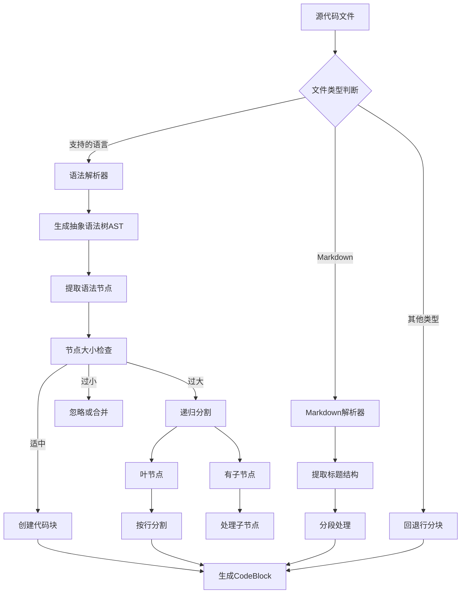

## 代码解析和分块策略深度改进

基于KiloCode的设计思想，当前架构在代码解析方面有显著的改进空间。让我详细分析并提出具体方案。

### 当前问题分析
- **简单行分块**: 缺乏语法结构感知，可能分割逻辑完整的代码块
- **多语言支持有限**: 主要依赖基础文本处理，缺乏语言特定优化
- **缺乏智能去重**: 相同代码块可能被重复处理
- **元数据提取不足**: 缺少函数名、类名等结构化信息

### 改进方案：智能语法感知分块



### 具体实现建议

#### 1. 多语言解析器集成

```typescript
// 支持的语言解析器配置
const LANGUAGE_PARSERS = {
  '.ts': 'typescript',
  '.js': 'javascript', 
  '.tsx': 'tsx',
  '.jsx': 'jsx',
  '.py': 'python',
  '.java': 'java',
  '.go': 'go',
  '.rs': 'rust',
  '.cpp': 'cpp',
  '.c': 'c',
  '.md': 'markdown'
};

// 解析器管理器
class LanguageParserManager {
  private loadedParsers: Map<string, any> = new Map();
  private pendingLoads: Map<string, Promise<any>> = new Map();
  
  async getParser(fileExtension: string): Promise<any> {
    const language = LANGUAGE_PARSERS[fileExtension];
    if (!language) return null;
    
    // 实现解析器懒加载和缓存
    if (this.loadedParsers.has(language)) {
      return this.loadedParsers.get(language);
    }
    
    if (this.pendingLoads.has(language)) {
      return this.pendingLoads.get(language);
    }
    
    const loadPromise = this.loadParser(language);
    this.pendingLoads.set(language, loadPromise);
    
    try {
      const parser = await loadPromise;
      this.loadedParsers.set(language, parser);
      this.pendingLoads.delete(language);
      return parser;
    } catch (error) {
      this.pendingLoads.delete(language);
      throw error;
    }
  }
}
```

#### 2. 智能分块算法

```typescript
// 代码块大小配置
const BLOCK_CONFIG = {
  MIN_CHARS: 50,        // 最小代码块字符数
  MAX_CHARS: 2000,      // 最大代码块字符数
  TOLERANCE_FACTOR: 1.2, // 最大字符容差
  MIN_REMAINDER: 100    // 最小剩余块字符数
};

class SmartChunker {
  async chunkBySyntax(ast: any, filePath: string, fileHash: string): Promise<CodeBlock[]> {
    const blocks: CodeBlock[] = [];
    const seenHashes = new Set<string>();
    
    // 遍历AST节点
    const nodes = this.extractRelevantNodes(ast);
    
    for (const node of nodes) {
      const content = this.getNodeContent(node);
      const charCount = content.length;
      
      if (charCount < BLOCK_CONFIG.MIN_CHARS) {
        // 过小节点，忽略或与相邻节点合并
        continue;
      }
      
      if (charCount <= BLOCK_CONFIG.MAX_CHARS * BLOCK_CONFIG.TOLERANCE_FACTOR) {
        // 适中节点，直接创建代码块
        const block = this.createCodeBlock(node, filePath, fileHash, content);
        if (!seenHashes.has(block.segmentHash)) {
          blocks.push(block);
          seenHashes.add(block.segmentHash);
        }
      } else {
        // 过大节点，需要分割
        if (this.hasChildNodes(node)) {
          // 递归处理子节点
          const childBlocks = await this.chunkBySyntax(node, filePath, fileHash);
          blocks.push(...childBlocks);
        } else {
          // 叶节点，按行分割
          const lineBlocks = this.chunkByLines(content, filePath, fileHash, seenHashes);
          blocks.push(...lineBlocks);
        }
      }
    }
    
    return blocks;
  }
}
```

#### 3. Markdown特殊处理

```typescript
class MarkdownProcessor {
  parseMarkdownContent(content: string, filePath: string, fileHash: string): CodeBlock[] {
    const blocks: CodeBlock[] = [];
    const seenHashes = new Set<string>();
    
    // 解析Markdown标题结构
    const headings = this.extractHeadings(content);
    let currentPosition = 0;
    
    // 处理标题前的内容
    if (headings.length > 0 && headings[0].position > 0) {
      const preContent = content.substring(0, headings[0].position);
      const preBlocks = this.chunkText(preContent, filePath, fileHash, 'markdown_intro', seenHashes);
      blocks.push(...preBlocks);
    }
    
    // 处理各个标题节段
    for (let i = 0; i < headings.length; i++) {
      const currentHeading = headings[i];
      const nextHeading = headings[i + 1];
      
      const startPos = currentHeading.position + currentHeading.text.length;
      const endPos = nextHeading ? nextHeading.position : content.length;
      const sectionContent = content.substring(startPos, endPos).trim();
      
      if (sectionContent) {
        const sectionBlocks = this.chunkText(
          sectionContent, 
          filePath, 
          fileHash, 
          `markdown_header_${currentHeading.level}`,
          seenHashes
        );
        blocks.push(...sectionBlocks);
      }
    }
    
    return blocks;
  }
}
```

#### 4. 哈希去重机制

```typescript
class DeduplicationService {
  generateSegmentHash(content: string, filePath: string, startLine: number): string {
    const hash = createHash('sha256');
    hash.update(content.normalize());
    hash.update(filePath);
    hash.update(startLine.toString());
    return hash.digest('hex');
  }
  
  isDuplicate(block: CodeBlock, seenHashes: Set<string>): boolean {
    return seenHashes.has(block.segmentHash);
  }
  
  addToSeen(block: CodeBlock, seenHashes: Set<string>): void {
    seenHashes.add(block.segmentHash);
  }
}
```

### 性能优化建议

1. **解析器缓存**: 避免重复加载同一语言的解析器
2. **并发处理**: 使用p-limit控制并发数量，async-mutex确保线程安全
3. **批量操作**: 批量处理代码块减少API调用
4. **内存管理**: 流式处理大文件，避免内存溢出

### 集成到当前架构

```typescript
// 修改现有的IndexService
class EnhancedIndexService {
  private parser: SmartCodeParser;
  private deduplication: DeduplicationService;
  
  async indexFile(filePath: string): Promise<void> {
    const content = await this.readFile(filePath);
    const fileHash = this.generateFileHash(content);
    
    const blocks = await this.parser.parseContent(content, filePath, fileHash);
    
    // 去重处理
    const uniqueBlocks = blocks.filter(block => 
      !this.deduplication.isDuplicate(block)
    );
    
    // 批量生成嵌入向量
    const embeddings = await this.embeddingService.createEmbeddings(
      uniqueBlocks.map(b => b.content)
    );
    
    // 存储到向量数据库
    await this.vectorStore.upsertPoints(
      uniqueBlocks.map((block, index) => ({
        id: block.segmentHash,
        vector: embeddings[index],
        payload: {
          ...block,
          language: this.detectLanguage(filePath)
        }
      }))
    );
  }
}
```

这个改进方案将显著提升代码解析的准确性和效率，为后续的搜索和分析提供更好的基础数据。