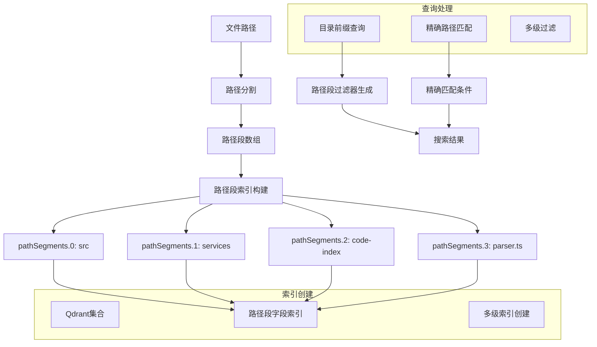

## 向量存储和路径索引机制优化

基于KiloCode的设计思想，当前架构在向量存储方面需要增强目录级过滤和精确路径匹配能力。让我设计一个完整的优化方案。

### 架构设计：路径段索引系统



### 核心实现方案

#### 1. 路径段索引数据结构

```typescript
// 路径段处理工具类
class PathSegmentIndexer {
  static extractPathSegments(filePath: string, workspaceRoot: string): Record<string, string> {
    // 获取相对路径
    const relativePath = path.isAbsolute(filePath) 
      ? path.relative(workspaceRoot, filePath)
      : filePath;
    
    // 规范化路径并分割
    const normalizedPath = path.normalize(relativePath);
    const segments = normalizedPath.split(path.sep).filter(Boolean);
    
    // 构建路径段索引对象
    const pathSegments: Record<string, string> = {};
    segments.forEach((segment, index) => {
      pathSegments[`pathSegments.${index}`] = segment;
    });
    
    return pathSegments;
  }

  static createPathFilter(directoryPrefix: string, workspaceRoot: string): any {
    if (!directoryPrefix || directoryPrefix === '.' || directoryPrefix === './') {
      return undefined; // 搜索整个工作区
    }

    // 规范化目录前缀
    const normalizedPrefix = path.posix.normalize(directoryPrefix.replace(/\\/g, '/'));
    const cleanedPrefix = path.posix.normalize(
      normalizedPrefix.startsWith('./') ? normalizedPrefix.slice(2) : normalizedPrefix
    );
    
    const segments = cleanedPrefix.split('/').filter(Boolean);
    
    if (segments.length === 0) {
      return undefined;
    }

    // 构建多级路径过滤器
    return {
      must: segments.map((segment, index) => ({
        key: `pathSegments.${index}`,
        match: { value: segment }
      }))
    };
  }
}
```

#### 2. 增强的Qdrant向量存储实现

```typescript
class EnhancedQdrantVectorStore implements IVectorStore {
  private client: QdrantClient;
  private collectionName: string;
  private workspacePath: string;

  constructor(workspacePath: string, qdrantUrl: string, vectorSize: number, apiKey?: string) {
    this.client = new QdrantClient({ 
      url: this.normalizeQdrantUrl(qdrantUrl),
      apiKey
    });
    this.workspacePath = workspacePath;
    this.collectionName = this.generateCollectionName(workspacePath);
  }

  async initialize(): Promise<boolean> {
    // 检查集合是否存在
    const exists = await this.collectionExists();
    
    if (!exists) {
      await this.createCollection();
    } else {
      // 验证向量维度匹配
      const info = await this.client.getCollectionInfo(this.collectionName);
      const existingSize = info.config?.params?.vectors?.size;
      
      if (existingSize !== this.vectorSize) {
        await this.recreateCollectionWithNewDimension(existingSize);
      }
    }

    // 创建路径段索引
    await this.createPathSegmentIndexes();
    
    return true;
  }

  private async createPathSegmentIndexes(): Promise<void> {
    // 为路径段0-4创建索引
    for (let i = 0; i <= 4; i++) {
      try {
        await this.client.createPayloadIndex(this.collectionName, {
          field_name: `pathSegments.${i}`,
          field_schema: "keyword"
        });
      } catch (error: any) {
        // 忽略"已存在"错误
        if (!error.message?.toLowerCase().includes('already exists')) {
          console.warn(`Failed to create index for pathSegments.${i}:`, error.message);
        }
      }
    }
  }

  async upsertPoints(points: PointStruct[]): Promise<void> {
    const enhancedPoints = points.map(point => ({
      ...point,
      payload: {
        ...point.payload,
        ...PathSegmentIndexer.extractPathSegments(
          point.payload.filePath, 
          this.workspacePath
        )
      }
    }));

    await this.client.upsert(this.collectionName, {
      points: enhancedPoints,
      wait: true
    });
  }

  async search(
    queryVector: number[],
    directoryPrefix?: string,
    minScore: number = 0.4,
    maxResults: number = 10
  ): Promise<VectorStoreSearchResult[]> {
    const filter = PathSegmentIndexer.createPathFilter(directoryPrefix, this.workspacePath);
    
    const results = await this.client.search(this.collectionName, {
      vector: queryVector,
      filter,
      limit: maxResults,
      score_threshold: minScore,
      with_payload: true,
      with_vector: false
    });

    return results.map(result => ({
      id: result.id,
      score: result.score || 0,
      payload: result.payload ? this.normalizePayload(result.payload) : null
    }));
  }
}
```

#### 3. 精确路径删除功能

```typescript
class EnhancedDeletionService {
  async deletePointsByFilePath(filePath: string): Promise<void> {
    const filter = this.createExactPathFilter(filePath);
    await this.deletePointsByFilter(filter);
  }

  async deletePointsByMultipleFilePaths(filePaths: string[]): Promise<void> {
    if (filePaths.length === 0) return;

    if (filePaths.length === 1) {
      return this.deletePointsByFilePath(filePaths[0]);
    }

    // 多文件路径使用OR条件
    const filters = filePaths.map(filePath => 
      this.createExactPathFilter(filePath)
    );

    const filter = { should: filters };
    await this.deletePointsByFilter(filter);
  }

  private createExactPathFilter(filePath: string): any {
    const relativePath = path.isAbsolute(filePath) 
      ? path.relative(this.workspaceRoot, filePath)
      : filePath;
    
    const normalizedPath = path.normalize(relativePath);
    const segments = normalizedPath.split(path.sep).filter(Boolean);
    
    // 创建精确匹配所有路径段的过滤器
    return {
      must: segments.map((segment, index) => ({
        key: `pathSegments.${index}`,
        match: { value: segment }
      }))
    };
  }

  private async deletePointsByFilter(filter: any): Promise<void> {
    await this.client.delete(this.collectionName, {
      filter,
      wait: true
    });
  }
}
```

#### 4. 维度适配和集合迁移

```typescript
class DimensionAwareVectorStore {
  private async recreateCollectionWithNewDimension(existingDimension: number): Promise<boolean> {
    console.log(`Vector dimension mismatch: expected ${this.vectorSize}, found ${existingDimension}. Recreating collection...`);
    
    try {
      // 1. 删除现有集合
      await this.client.deleteCollection(this.collectionName);
      
      // 2. 等待删除完成
      await this.waitForCollectionDeletion();
      
      // 3. 使用正确维度创建新集合
      await this.createCollection();
      
      // 4. 重新创建索引
      await this.createPathSegmentIndexes();
      
      console.log(`Collection recreated with correct dimension: ${this.vectorSize}`);
      return true;
      
    } catch (error) {
      console.error('Failed to recreate collection:', error);
      throw new Error(`Cannot proceed with dimension mismatch: ${existingDimension} -> ${this.vectorSize}`);
    }
  }

  private async waitForCollectionDeletion(): Promise<void> {
    const maxAttempts = 10;
    const delayMs = 1000;
    
    for (let attempt = 1; attempt <= maxAttempts; attempt++) {
      const exists = await this.collectionExists();
      
      if (!exists) {
        return;
      }
      
      if (attempt === maxAttempts) {
        throw new Error('Collection deletion timeout');
      }
      
      await new Promise(resolve => setTimeout(resolve, delayMs));
    }
  }
}
```

#### 5. 高级查询功能

```typescript
class AdvancedSearchService {
  async searchWithAdvancedFilters(
    queryVector: number[],
    options: AdvancedSearchOptions
  ): Promise<VectorStoreSearchResult[]> {
    const baseFilter = PathSegmentIndexer.createPathFilter(
      options.directoryPrefix, 
      this.workspacePath
    );

    const combinedFilter = this.combineFilters(baseFilter, {
      language: options.languageFilter,
      fileType: options.fileTypeFilter,
      minLines: options.minLines,
      maxLines: options.maxLines
    });

    const results = await this.client.search(this.collectionName, {
      vector: queryVector,
      filter: combinedFilter,
      limit: options.maxResults || 10,
      score_threshold: options.minScore || 0.4,
      with_payload: true
    });

    return this.processSearchResults(results, options);
  }

  private combineFilters(baseFilter: any, additionalFilters: any): any {
    if (!additionalFilters) return baseFilter;
    
    const conditions = baseFilter ? [baseFilter] : [];
    
    if (additionalFilters.language) {
      conditions.push({
        key: 'language',
        match: { value: additionalFilters.language }
      });
    }
    
    if (additionalFilters.fileType) {
      conditions.push({
        key: 'fileType',
        match: { value: additionalFilters.fileType }
      });
    }

    if (additionalFilters.minLines !== undefined) {
      conditions.push({
        key: 'lineCount',
        range: { gte: additionalFilters.minLines }
      });
    }

    if (conditions.length === 0) return undefined;
    if (conditions.length === 1) return conditions[0];
    
    return { must: conditions };
  }
}
```

### 集成到当前MCP服务

```typescript
// 修改ServiceFactory以支持增强的向量存储
class EnhancedServiceFactory {
  createVectorStore(): IVectorStore {
    const config = this.configManager.getConfig();
    
    // 自动确定向量维度
    const vectorSize = getModelDimension(config.embedderProvider, config.modelId) 
      || config.modelDimension;

    if (!vectorSize) {
      throw new Error('Cannot determine vector dimension for model');
    }

    return new EnhancedQdrantVectorStore(
      this.workspacePath,
      config.qdrantUrl,
      vectorSize,
      config.qdrantApiKey
    );
  }

  createSearchService(): SearchService {
    return new AdvancedSearchService(
      this.createVectorStore(),
      this.createEmbedder()
    );
  }
}
```

### 性能优化建议

1. **批量操作优化**: 使用更大的批处理大小减少网络往返
2. **连接池管理**: 实现Qdrant连接池避免连接创建开销
3. **索引预创建**: 在服务启动时预创建所有必要的索引
4. **缓存策略**: 实现查询结果缓存减少重复搜索
5. **异步处理**: 使用异步队列处理大批量操作

这个优化方案提供了强大的路径索引能力，支持精确的目录级过滤和文件级操作，同时保持了良好的性能和可扩展性。