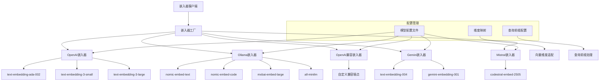

## 多嵌入器提供商支持方案

基于KiloCode的设计思想，当前架构仅支持OpenAI嵌入服务，这限制了部署灵活性和成本优化。让我设计一个完整的多嵌入器提供商支持方案。

### 架构设计：统一嵌入器接口



### 核心接口设计

```typescript
// 统一嵌入器接口
interface IEmbedder {
  createEmbeddings(texts: string[], model?: string): Promise<EmbeddingResponse>;
  validateConfiguration(): Promise<{ valid: boolean; error?: string }>;
  get embedderInfo(): EmbedderInfo;
}

// 嵌入响应结构
interface EmbeddingResponse {
  embeddings: number[][];
  usage?: {
    promptTokens: number;
    totalTokens: number;
  };
}

// 嵌入器信息
interface EmbedderInfo {
  name: AvailableEmbedders;
  supportedModels: string[];
}

// 支持的嵌入器类型
type AvailableEmbedders = 
  | "openai" 
  | "ollama" 
  | "openai-compatible" 
  | "gemini" 
  | "mistral";

// 模型配置接口
interface EmbeddingModelProfile {
  dimension: number;
  scoreThreshold?: number;
  queryPrefix?: string;
}

type EmbeddingModelProfiles = {
  [provider in EmbedderProvider]?: {
    [modelId: string]: EmbeddingModelProfile;
  }
};
```

### 具体实现方案

#### 1. 嵌入器工厂模式

```typescript
class EmbedderFactory {
  static createEmbedder(
    provider: AvailableEmbedders, 
    config: EmbedderConfig
  ): IEmbedder {
    switch (provider) {
      case 'openai':
        return new OpenAiEmbedder(config);
      case 'ollama':
        return new OllamaEmbedder(config);
      case 'openai-compatible':
        return new OpenAiCompatibleEmbedder(config);
      case 'gemini':
        return new GeminiEmbedder(config);
      case 'mistral':
        return new MistralEmbedder(config);
      default:
        throw new Error(`Unsupported embedder provider: ${provider}`);
    }
  }
}
```

#### 2. OpenAI嵌入器实现

```typescript
class OpenAiEmbedder implements IEmbedder {
  private client: OpenAI;
  private config: OpenAiConfig;

  constructor(config: OpenAiConfig) {
    this.client = new OpenAI({
      apiKey: config.apiKey,
      maxRetries: config.maxRetries || 3,
      timeout: config.timeout || 30000
    });
    this.config = config;
  }

  async createEmbeddings(texts: string[], model?: string): Promise<EmbeddingResponse> {
    const targetModel = model || this.config.defaultModel || 'text-embedding-ada-002';
    
    try {
      const response = await this.client.embeddings.create({
        model: targetModel,
        input: texts,
        encoding_format: 'float'
      });

      return {
        embeddings: response.data.map(item => item.embedding),
        usage: {
          promptTokens: response.usage?.prompt_tokens || 0,
          totalTokens: response.usage?.total_tokens || 0
        }
      };
    } catch (error) {
      throw this.handleOpenAiError(error);
    }
  }

  async validateConfiguration(): Promise<{ valid: boolean; error?: string }> {
    if (!this.config.apiKey) {
      return { valid: false, error: 'OpenAI API key is required' };
    }

    try {
      // 测试连接和认证
      await this.client.models.list();
      return { valid: true };
    } catch (error) {
      return { 
        valid: false, 
        error: `OpenAI configuration validation failed: ${error.message}` 
      };
    }
  }

  get embedderInfo(): EmbedderInfo {
    return {
      name: 'openai',
      supportedModels: [
        'text-embedding-ada-002',
        'text-embedding-3-small',
        'text-embedding-3-large'
      ]
    };
  }
}
```

#### 3. Ollama嵌入器实现（支持本地部署）

```typescript
class OllamaEmbedder implements IEmbedder {
  private baseUrl: string;
  private config: OllamaConfig;

  constructor(config: OllamaConfig) {
    this.baseUrl = this.normalizeUrl(config.baseUrl || 'http://localhost:11434');
    this.config = config;
  }

  async createEmbeddings(texts: string[], model?: string): Promise<EmbeddingResponse> {
    const targetModel = model || this.config.defaultModel || 'nomic-embed-text';
    const embeddings: number[][] = [];

    for (const text of texts) {
      // 处理查询前缀（特别是nomic-embed-code需要特殊前缀）
      const processedText = this.applyQueryPrefix(targetModel, text);
      
      const response = await fetch(`${this.baseUrl}/api/embeddings`, {
        method: 'POST',
        headers: { 'Content-Type': 'application/json' },
        body: JSON.stringify({
          model: targetModel,
          prompt: processedText
        })
      });

      if (!response.ok) {
        throw new Error(`Ollama API error: ${response.statusText}`);
      }

      const data = await response.json();
      embeddings.push(data.embedding);
    }

    return { embeddings };
  }

  private applyQueryPrefix(model: string, text: string): string {
    if (model === 'nomic-embed-code') {
      return `Represent this query for searching relevant code: ${text}`;
    }
    return text;
  }

  async validateConfiguration(): Promise<{ valid: boolean; error?: string }> {
    try {
      const response = await fetch(`${this.baseUrl}/api/tags`);
      if (!response.ok) {
        return { valid: false, error: 'Ollama service not available' };
      }

      // 验证模型是否存在
      const models = await response.json();
      const targetModel = this.config.defaultModel || 'nomic-embed-text';
      const modelExists = models.models?.some((m: any) => m.name === targetModel);

      if (!modelExists) {
        return { 
          valid: false, 
          error: `Model ${targetModel} not found in Ollama` 
        };
      }

      return { valid: true };
    } catch (error) {
      return { 
        valid: false, 
        error: `Ollama configuration validation failed: ${error.message}` 
      };
    }
  }
}
```

#### 4. 模型配置管理

```typescript
// 模型配置文件
const EMBEDDING_MODEL_PROFILES: EmbeddingModelProfiles = {
  openai: {
    'text-embedding-ada-002': {
      dimension: 1536,
      scoreThreshold: 0.4
    },
    'text-embedding-3-small': {
      dimension: 1536, 
      scoreThreshold: 0.4
    },
    'text-embedding-3-large': {
      dimension: 3072,
      scoreThreshold: 0.4
    }
  },
  ollama: {
    'nomic-embed-text': {
      dimension: 768,
      scoreThreshold: 0.4
    },
    'nomic-embed-code': {
      dimension: 3584,
      scoreThreshold: 0.15,
      queryPrefix: 'Represent this query for searching relevant code: '
    },
    'mxbai-embed-large': {
      dimension: 1024,
      scoreThreshold: 0.4
    },
    'all-minilm': {
      dimension: 384,
      scoreThreshold: 0.4
    }
  },
  gemini: {
    'text-embedding-004': {
      dimension: 768
    },
    'gemini-embedding-001': {
      dimension: 3072,
      scoreThreshold: 0.4
    }
  },
  mistral: {
    'codestral-embed-2505': {
      dimension: 1536,
      scoreThreshold: 0.4
    }
  }
};

// 工具函数
export function getModelDimension(provider: AvailableEmbedders, modelId: string): number {
  return EMBEDDING_MODEL_PROFILES[provider]?.[modelId]?.dimension;
}

export function getModelScoreThreshold(provider: AvailableEmbedders, modelId: string): number {
  return EMBEDDING_MODEL_PROFILES[provider]?.[modelId]?.scoreThreshold || 0.4;
}

export function getModelQueryPrefix(provider: AvailableEmbedders, modelId: string): string {
  return EMBEDDING_MODEL_PROFILES[provider]?.[modelId]?.queryPrefix || '';
}
```

#### 5. 配置管理和服务集成

```typescript
class EmbeddingService {
  private embedder: IEmbedder;
  private configManager: ConfigManager;

  async initialize(): Promise<void> {
    const config = this.configManager.getEmbedderConfig();
    this.embedder = EmbedderFactory.createEmbedder(config.provider, config);
    
    // 验证配置
    const validation = await this.embedder.validateConfiguration();
    if (!validation.valid) {
      throw new Error(`Embedder configuration invalid: ${validation.error}`);
    }
  }

  async createEmbeddings(texts: string[]): Promise<EmbeddingResponse> {
    // 批处理和速率限制
    const batches = this.createBatches(texts);
    const allEmbeddings: number[][] = [];

    for (const batch of batches) {
      const response = await this.embedder.createEmbeddings(batch);
      allEmbeddings.push(...response.embeddings);
      
      // 速率限制控制
      await this.applyRateLimiting();
    }

    return { embeddings: allEmbeddings };
  }

  private createBatches(texts: string[]): string[][] {
    const batches: string[][] = [];
    let currentBatch: string[] = [];
    let currentTokenCount = 0;

    for (const text of texts) {
      const tokenCount = this.estimateTokens(text);
      
      if (currentTokenCount + tokenCount > 8192) { // OpenAI批处理限制
        batches.push(currentBatch);
        currentBatch = [text];
        currentTokenCount = tokenCount;
      } else {
        currentBatch.push(text);
        currentTokenCount += tokenCount;
      }
    }

    if (currentBatch.length > 0) {
      batches.push(currentBatch);
    }

    return batches;
  }
}
```

### 集成到当前MCP服务

```typescript
// 修改ServiceFactory
class ServiceFactory {
  createEmbedder(): IEmbedder {
    const config = this.configManager.getConfig();
    const embedderConfig = {
      provider: config.embedderProvider,
      apiKey: config.openAiApiKey,
      baseUrl: config.ollamaBaseUrl,
      defaultModel: config.modelId
    };

    return EmbedderFactory.createEmbedder(config.embedderProvider, embedderConfig);
  }

  createVectorStore(): IVectorStore {
    const config = this.configManager.getConfig();
    
    // 自动确定向量维度
    const vectorSize = getModelDimension(config.embedderProvider, config.modelId) 
      || config.modelDimension;

    if (!vectorSize) {
      throw new Error('Cannot determine vector dimension for model');
    }

    return new QdrantVectorStore(
      this.workspacePath,
      config.qdrantUrl,
      vectorSize,
      config.qdrantApiKey
    );
  }
}
```

这个多嵌入器提供商支持方案提供了极大的灵活性和可扩展性，支持从云端到本部的各种部署场景，同时保持了统一的接口和配置管理。