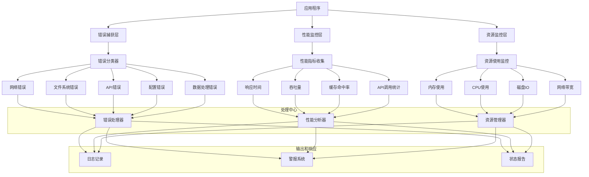

## 错误处理和监控机制完善

基于KiloCode的设计思想和当前架构的需求，让我设计一个完整的错误处理和监控体系。

### 架构设计：全方位监控系统



### 核心实现方案

#### 1. 统一错误处理框架

```typescript
// 错误类型定义
enum ErrorCategory {
  NETWORK = 'network',
  FILESYSTEM = 'filesystem',
  DATABASE = 'database',
  API = 'api',
  CONFIGURATION = 'configuration',
  VALIDATION = 'validation',
  PROCESSING = 'processing',
  UNKNOWN = 'unknown'
}

interface AppError extends Error {
  category: ErrorCategory;
  code: string;
  timestamp: Date;
  context?: Record<string, any>;
  isRetryable: boolean;
  originalError?: Error;
}

// 错误工厂
class ErrorFactory {
  static createError(
    message: string,
    category: ErrorCategory,
    code: string,
    options: {
      originalError?: Error;
      context?: Record<string, any>;
      isRetryable?: boolean;
    } = {}
  ): AppError {
    const error = new Error(message) as AppError;
    error.category = category;
    error.code = code;
    error.timestamp = new Date();
    error.context = options.context;
    error.isRetryable = options.isRetryable ?? this.isRetryable(category, code);
    error.originalError = options.originalError;
    
    return error;
  }

  static fromUnknownError(error: unknown, context?: string): AppError {
    if (error instanceof AppError) {
      return error;
    }

    const err = error as Error;
    return this.createError(
      err.message || 'Unknown error occurred',
      ErrorCategory.UNKNOWN,
      'UNKNOWN_ERROR',
      {
        originalError: err,
        context: { originalContext: context }
      }
    );
  }

  private static isRetryable(category: ErrorCategory, code: string): boolean {
    const retryableErrors = new Set([
      'NETWORK_TIMEOUT',
      'RATE_LIMITED',
      'DATABASE_CONNECTION',
      'API_UNAVAILABLE'
    ]);
    
    return retryableErrors.has(code) || [
      ErrorCategory.NETWORK,
      ErrorCategory.API,
      ErrorCategory.DATABASE
    ].includes(category);
  }
}

// 错误代码常量
const ErrorCodes = {
  // 网络错误
  NETWORK_TIMEOUT: 'NETWORK_TIMEOUT',
  NETWORK_CONNECTION: 'NETWORK_CONNECTION',
  
  // 文件系统错误
  FILE_NOT_FOUND: 'FILE_NOT_FOUND',
  FILE_READ_ERROR: 'FILE_READ_ERROR',
  FILE_WRITE_ERROR: 'FILE_WRITE_ERROR',
  
  // 数据库错误
  DATABASE_CONNECTION: 'DATABASE_CONNECTION',
  DATABASE_QUERY: 'DATABASE_QUERY',
  DATABASE_TIMEOUT: 'DATABASE_TIMEOUT',
  
  // API错误
  API_UNAUTHORIZED: 'API_UNAUTHORIZED',
  API_RATE_LIMITED: 'API_RATE_LIMITED',
  API_INVALID_RESPONSE: 'API_INVALID_RESPONSE',
  
  // 配置错误
  CONFIG_MISSING: 'CONFIG_MISSING',
  CONFIG_INVALID: 'CONFIG_INVALID',
  
  // 验证错误
  VALIDATION_FAILED: 'VALIDATION_FAILED',
  
  // 处理错误
  PROCESSING_TIMEOUT: 'PROCESSING_TIMEOUT',
  PROCESSING_RESOURCE: 'PROCESSING_RESOURCE'
};
```

#### 2. 错误处理器和重试机制

```typescript
class ErrorHandler {
  private logger: Logger;
  private metrics: MetricsCollector;
  private maxRetries: Map<ErrorCategory, number> = new Map();

  constructor() {
    this.maxRetries.set(ErrorCategory.NETWORK, 5);
    this.maxRetries.set(ErrorCategory.API, 3);
    this.maxRetries.set(ErrorCategory.DATABASE, 3);
    this.maxRetries.set(ErrorCategory.FILESYSTEM, 2);
    this.maxRetries.set(ErrorCategory.PROCESSING, 1);
  }

  async handleError(error: AppError, operation: string): Promise<void> {
    // 记录错误
    this.logger.error('Error occurred', {
      operation,
      error: error.message,
      category: error.category,
      code: error.code,
      context: error.context,
      stack: error.stack
    });

    // 收集指标
    this.metrics.recordError(error.category, error.code);

    // 根据错误类型采取不同策略
    switch (error.category) {
      case ErrorCategory.NETWORK:
        await this.handleNetworkError(error, operation);
        break;
      case ErrorCategory.API:
        await this.handleApiError(error, operation);
        break;
      case ErrorCategory.DATABASE:
        await this.handleDatabaseError(error, operation);
        break;
      case ErrorCategory.CONFIGURATION:
        await this.handleConfigurationError(error, operation);
        break;
      default:
        await this.handleGenericError(error, operation);
    }
  }

  async withRetry<T>(
    operation: () => Promise<T>,
    operationName: string,
    context?: Record<string, any>
  ): Promise<T> {
    let lastError: AppError;
    const maxAttempts = 3;

    for (let attempt = 1; attempt <= maxAttempts; attempt++) {
      try {
        return await operation();
      } catch (error) {
        const appError = ErrorFactory.fromUnknownError(error, operationName);
        appError.context = { ...appError.context, ...context, attempt };
        
        lastError = appError;

        if (!appError.isRetryable || attempt >= maxAttempts) {
          break;
        }

        // 指数退避
        const delay = Math.pow(2, attempt) * 1000;
        await new Promise(resolve => setTimeout(resolve, delay));

        this.logger.warn(`Retrying operation ${operationName}, attempt ${attempt + 1}`, {
          delay,
          error: appError.message
        });
      }
    }

    await this.handleError(lastError!, operationName);
    throw lastError!;
  }
}
```

#### 3. 性能监控系统

```typescript
interface PerformanceMetrics {
  embeddingTime: Histogram;
  indexingTime: Histogram;
  searchTime: Histogram;
  fileProcessingTime: Histogram;
  memoryUsage: Gauge;
  apiCalls: Counter;
  cacheHits: Counter;
  errors: Counter;
}

class MetricsCollector {
  private metrics: PerformanceMetrics;
  private prometheusClient: any;

  constructor() {
    this.initializeMetrics();
  }

  private initializeMetrics(): void {
    this.metrics = {
      embeddingTime: new prometheus.Histogram({
        name: 'code_index_embedding_time_seconds',
        help: 'Time spent generating embeddings',
        buckets: [0.1, 0.5, 1, 2, 5, 10]
      }),
      
      indexingTime: new prometheus.Histogram({
        name: 'code_index_indexing_time_seconds',
        help: 'Time spent indexing files',
        buckets: [1, 5, 10, 30, 60, 120]
      }),

      searchTime: new prometheus.Histogram({
        name: 'code_index_search_time_seconds',
        help: 'Time spent searching',
        buckets: [0.01, 0.05, 0.1, 0.5, 1, 2]
      }),

      memoryUsage: new prometheus.Gauge({
        name: 'code_index_memory_usage_bytes',
        help: 'Current memory usage in bytes'
      }),

      apiCalls: new prometheus.Counter({
        name: 'code_index_api_calls_total',
        help: 'Total number of API calls',
        labelNames: ['provider', 'status']
      }),

      cacheHits: new prometheus.Counter({
        name: 'code_index_cache_hits_total',
        help: 'Total number of cache hits',
        labelNames: ['type']
      }),

      errors: new prometheus.Counter({
        name: 'code_index_errors_total',
        help: 'Total number of errors',
        labelNames: ['category', 'code']
      })
    };
  }

  trackOperation<T>(metricName: keyof PerformanceMetrics, operation: () => Promise<T>): Promise<T> {
    const end = this.metrics[metricName].startTimer();
    
    return operation().then(result => {
      end();
      return result;
    }).catch(error => {
      end();
      throw error;
    });
  }

  recordError(category: ErrorCategory, code: string): void {
    this.metrics.errors.inc({ category, code });
  }

  recordApiCall(provider: string, success: boolean): void {
    this.metrics.apiCalls.inc({ 
      provider, 
      status: success ? 'success' : 'error' 
    });
  }

  recordCacheHit(cacheType: string): void {
    this.metrics.cacheHits.inc({ type: cacheType });
  }

  updateMemoryUsage(): void {
    const memoryUsage = process.memoryUsage();
    this.metrics.memoryUsage.set(memoryUsage.heapUsed);
  }
}
```

#### 4. 健康检查和就绪探针

```typescript
class HealthCheckService {
  private checks: Map<string, HealthCheck> = new Map();
  private interval: NodeJS.Timeout;

  constructor() {
    this.initializeChecks();
    this.startPeriodicChecks();
  }

  private initializeChecks(): void {
    this.checks.set('database', {
      name: 'Database Connection',
      check: async () => this.checkDatabase(),
      timeout: 5000,
      critical: true
    });

    this.checks.set('api', {
      name: 'API Connectivity',
      check: async () => this.checkApi(),
      timeout: 3000,
      critical: false
    });

    this.checks.set('filesystem', {
      name: 'Filesystem Access',
      check: async () => this.checkFilesystem(),
      timeout: 2000,
      critical: true
    });
  }

  async checkHealth(): Promise<HealthStatus> {
    const results: HealthResult[] = [];
    let status: HealthStatus = 'healthy';

    for (const [name, check] of this.checks) {
      try {
        await Promise.race([
          check.check(),
          new Promise((_, reject) => 
            setTimeout(() => reject(new Error('Timeout')), check.timeout)
          )
        ]);
        results.push({ name, status: 'healthy', duration: 0 });
      } catch (error) {
        results.push({ 
          name, 
          status: 'unhealthy', 
          error: error.message,
          duration: 0
        });
        
        if (check.critical) {
          status = 'unhealthy';
        }
      }
    }

    return { status, timestamp: new Date(), results };
  }

  async readinessCheck(): Promise<boolean> {
    const health = await this.checkHealth();
    return health.status === 'healthy';
  }

  async livenessCheck(): Promise<boolean> {
    // 简化检查，确保进程还在运行
    return true;
  }
}
```

#### 5. 警报和通知系统

```typescript
interface AlertRule {
  name: string;
  condition: (metrics: PerformanceMetrics, errors: AppError[]) => boolean;
  severity: 'critical' | 'warning' | 'info';
  cooldown: number; // 冷却时间（毫秒）
  lastTriggered?: Date;
}

class AlertManager {
  private rules: AlertRule[] = [];
  private notifiers: Notifier[] = [];
  private errorBuffer: AppError[] = [];
  private maxBufferSize = 1000;

  constructor() {
    this.initializeAlertRules();
    this.startMonitoring();
  }

  private initializeAlertRules(): void {
    this.rules.push({
      name: 'High Error Rate',
      condition: (metrics, errors) => 
        metrics.errors.values().some(count => count > 100),
      severity: 'critical',
      cooldown: 300000 // 5分钟
    });

    this.rules.push({
      name: 'API Rate Limiting',
      condition: (metrics, errors) => 
        errors.some(error => 
          error.category === ErrorCategory.API && 
          error.code === ErrorCodes.API_RATE_LIMITED
        ),
      severity: 'warning',
      cooldown: 60000 // 1分钟
    });

    this.rules.push({
      name: 'High Memory Usage',
      condition: (metrics, errors) => 
        metrics.memoryUsage > 1024 * 1024 * 1024, // 1GB
      severity: 'warning',
      cooldown: 300000
    });
  }

  addError(error: AppError): void {
    this.errorBuffer.push(error);
    
    // 保持缓冲区大小
    if (this.errorBuffer.length > this.maxBufferSize) {
      this.errorBuffer = this.errorBuffer.slice(-this.maxBufferSize);
    }

    this.checkAlerts();
  }

  private checkAlerts(): void {
    const now = new Date();
    
    for (const rule of this.rules) {
      if (rule.lastTriggered && now.getTime() - rule.lastTriggered.getTime() < rule.cooldown) {
        continue;
      }

      if (rule.condition(this.metrics, this.errorBuffer)) {
        this.triggerAlert(rule);
        rule.lastTriggered = now;
      }
    }
  }

  private triggerAlert(rule: AlertRule): void {
    const alert: Alert = {
      rule: rule.name,
      severity: rule.severity,
      timestamp: new Date(),
      message: `Alert triggered: ${rule.name}`,
      details: {
        metrics: this.metrics,
        recentErrors: this.errorBuffer.slice(-10)
      }
    };

    this.notifiers.forEach(notifier => notifier.send(alert));
  }
}
```

#### 6. 集成到MCP服务

```typescript
class MonitoringIntegration {
  private errorHandler: ErrorHandler;
  private metricsCollector: MetricsCollector;
  private healthCheck: HealthCheckService;
  private alertManager: AlertManager;

  constructor(private mcpServer: MCPServer) {
    this.initializeMonitoring();
  }

  private initializeMonitoring(): void {
    this.errorHandler = new ErrorHandler();
    this.metricsCollector = new MetricsCollector();
    this.healthCheck = new HealthCheckService();
    this.alertManager = new AlertManager();

    // 设置全局错误处理
    process.on('uncaughtException', (error) => {
      this.handleUncaughtError(error);
    });

    process.on('unhandledRejection', (reason, promise) => {
      this.handleUnhandledRejection(reason, promise);
    });

    // 添加健康检查端点
    this.mcpServer.setResourceHandler('health', async () => {
      const health = await this.healthCheck.checkHealth();
      return {
        content: [{
          type: 'text',
          text: JSON.stringify(health, null, 2)
        }]
      };
    });

    // 添加指标端点
    this.mcpServer.setResourceHandler('metrics', async () => {
      const metrics = await this.metricsCollector.getMetrics();
      return {
        content: [{
          type: 'text',
          text: metrics
        }]
      };
    });
  }

  private handleUncaughtError(error: Error): void {
    const appError = ErrorFactory.fromUnknownError(error, 'uncaughtException');
    this.errorHandler.handleError(appError, 'uncaughtException');
    
    // 对于严重错误，考虑优雅关闭
    if (appError.category === ErrorCategory.CONFIGURATION) {
      process.exit(1);
    }
  }

  private handleUnhandledRejection(reason: any, promise: Promise<any>): void {
    const appError = ErrorFactory.fromUnknownError(reason, 'unhandledRejection');
    this.errorHandler.handleError(appError, 'unhandledRejection');
  }
}
```

### 配置和部署建议

1. **日志配置**: 使用结构化日志（JSON格式），便于后续分析
2. **监控仪表板**: 集成Prometheus + Grafana用于可视化监控
3. **警报渠道**: 支持多种通知方式（Email、Slack、Webhook）
4. **跟踪系统**: 考虑集成OpenTelemetry用于分布式跟踪
5. **性能基线**: 建立性能基线，便于检测异常

这个完善的错误处理和监控机制提供了全方位的可观察性，确保系统在出现问题时能够快速发现、诊断和恢复。